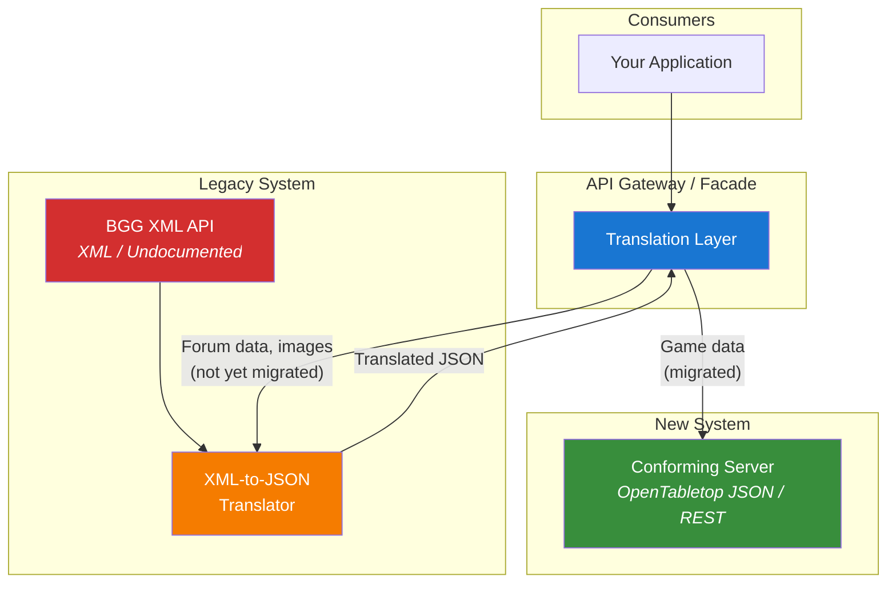
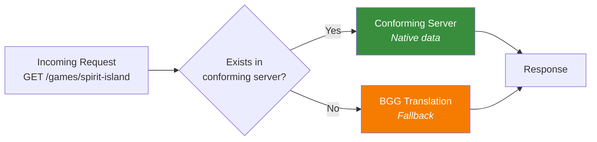

# Legacy Migration

Adopting the OpenTabletop standard while moving away from BGG's XML API is a gradual process. The architecture supports a **strangler fig** pattern: a translation layer that sits between consumers and BGG, progressively routing more traffic to a conforming OpenTabletop server as its dataset grows and the specification stabilizes.

## The Strangler Fig Pattern

The strangler fig is a tree that grows around an existing tree, eventually replacing it entirely. In software architecture, it means building a new system alongside an old one and gradually migrating traffic from old to new, with a facade layer that routes requests to the appropriate backend.

## How It Works

### Phase 1: Translation Layer Only

Initially, the facade routes *everything* to BGG through a translation layer that:

1. Accepts OpenTabletop-style JSON requests.
2. Translates them to BGG XML API calls.
3. Parses the XML response.
4. Maps BGG fields to OpenTabletop schema.
5. Returns a conformant OpenTabletop JSON response.

This gives consumers a stable, documented API immediately, even before the conforming server has its own data. The translation layer handles:

| BGG Endpoint | OpenTabletop Equivalent | Notes |
|-------------|--------------------------|-------|
| `GET /xmlapi2/thing?id=162886` | `GET /games/spirit-island` | Game entity mapping |
| `GET /xmlapi2/search?query=spirit` | `GET /games?q=spirit` | Name search |
| `GET /xmlapi2/thing?id=162886&stats=1` | `GET /games/spirit-island?include=polls,stats` | Statistics embedding |
| `GET /xmlapi2/family?id=39224` | `GET /families/spirit-island` | Family lookup |

### Phase 2: Dual Backend

As the conforming server's dataset grows (imported from BGG data, community contributions, publisher partnerships), the facade starts routing to the native API for entities that exist:

The routing decision is per-entity: if *Spirit Island* exists in the conforming server's database, serve it natively. If an obscure game has not been imported yet, fall back to BGG translation.

### Phase 3: Native Only

Once the dataset is comprehensive enough, the BGG translation layer is decommissioned. All requests are served natively from the conforming server. The facade becomes unnecessary and is removed.

## Field Mapping

Migrating from BGG's data model to OpenTabletop's requires careful field mapping. Key differences:

### Game Entity

| BGG XML Field | OpenTabletop Field | Notes |
|--------------|---------------------|-------|
| `@objectid` | `identifiers[source=bgg].external_id` | BGG ID becomes an external identifier |
| `name[@type='primary']/@value` | `name` | Primary name |
| `yearpublished/@value` | `year_published` | Direct mapping |
| `minplayers/@value` | `min_players` | Direct mapping |
| `maxplayers/@value` | `max_players` | Direct mapping |
| `minplaytime/@value` | `min_playtime` | Publisher-stated |
| `maxplaytime/@value` | `max_playtime` | Publisher-stated |
| `statistics/ratings/average/@value` | `rating` | Direct mapping |
| `statistics/ratings/averageweight/@value` | `weight` | Direct mapping |
| `link[@type='boardgamemechanic']` | `mechanics[]` | Must map to controlled vocabulary slugs |
| `link[@type='boardgamecategory']` | `categories[]` | Must map to controlled vocabulary slugs |
| `link[@type='boardgamedesigner']` | `people[role=designer]` | N:M relationship |
| `link[@type='boardgamepublisher']` | `organizations[role=publisher]` | N:M relationship |
| `link[@type='boardgameexpansion']` | `relationships[type=expands]` | Expansion relationships |
| `link[@type='boardgameimplementation']` | `relationships[type=reimplements]` | Reimplementation relationships |
| `poll[@name='suggested_numplayers']` | `PlayerCountPoll` | Per-count vote mapping |
| N/A | `community_min_playtime` | No BGG equivalent; community-sourced |
| N/A | `community_max_playtime` | No BGG equivalent; community-sourced |

### Key Differences

**No type discriminator in BGG.** BGG does not distinguish base games from expansions at the entity level -- you determine this from the presence of expansion links. The OpenTabletop specification defines an explicit `type` field.

**No dual playtime in BGG.** BGG stores only publisher-stated play time. Community play time is an OpenTabletop addition.

**No property deltas in BGG.** BGG has no concept of how expansions change base game properties. This is entirely new in the OpenTabletop specification.

**Taxonomy mapping.** BGG mechanics and categories are free text. Mapping them to OpenTabletop's controlled vocabulary requires a maintained mapping table (e.g., BGG "Deck, Bag, and Pool Building" maps to OpenTabletop `deck-building`).

## Data Import

The migration architecture includes a data import pipeline for bulk loading BGG data into a conforming server's database:

1. **BGG data dump.** Periodic snapshots of BGG data (available through BGG data exports or scraping within rate limits).
2. **Transformation.** Apply the field mapping, resolve taxonomy slugs, generate UUIDv7 identifiers, construct relationships.
3. **Deduplication.** Match entities by BGG ID to avoid duplicates on re-import.
4. **Enrichment.** Add OpenTabletop-specific data (community play times, property deltas, expansion combinations) from community contributions.
5. **Load.** Bulk insert into PostgreSQL.

The import pipeline is idempotent -- running it twice with the same input produces the same result. BGG IDs are stored as external identifiers and used as deduplication keys.

## For Application Developers

If you are building an application that currently uses the BGG XML API, the migration path is:

1. **Start using an OpenTabletop client library** with the translation layer as the backend. Your code uses the standard API immediately; the translation layer handles BGG communication.
2. **Map your BGG IDs.** Use the identifier lookup endpoint to find OpenTabletop UUIDs for your existing BGG IDs.
3. **Adopt new features incrementally.** Start using effective mode, community play times, and multi-dimensional filtering -- features that have no BGG equivalent.
4. **Remove BGG dependency.** Once the conforming server's dataset covers your needs, point your client at it directly and decommission the translation layer.

See [Migrating from BGG](../guides/migrating-from-bgg.md) for a practical step-by-step guide.
