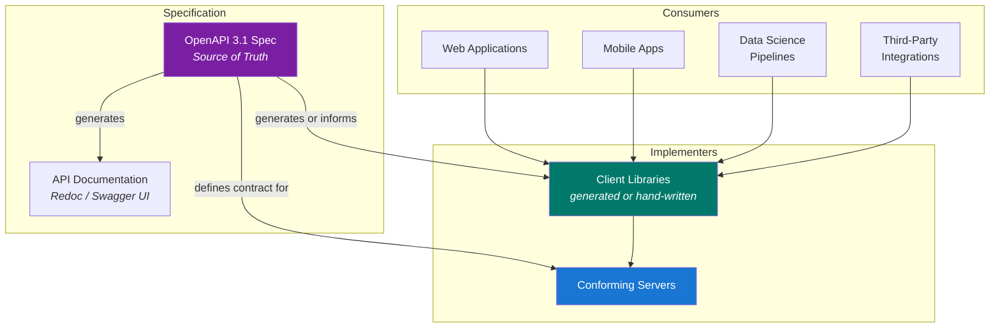

# System Overview

OpenTabletop is a specification-first project. The OpenAPI document is the canonical source of truth; documentation, tooling, and any conforming server or client are derived from or validated against that specification. This page describes the architectural patterns that implementers should follow when building against the spec.

## Architecture Diagram

> **Note:** The specification is the only artifact this project ships. Servers, clients, and tooling are built by implementers against the spec.

## Spec-First Design

The specification is written before any implementation code. The recommended workflow for implementers:

1. **Read the spec.** Endpoints, schemas, examples, and constraints are defined in the OpenAPI document.
2. **Generate artifacts** from the spec: client libraries, documentation, mock servers, and contract tests.
3. **Implement the server** to satisfy the contract. A conforming server should be validated against the spec using contract testing -- if the server returns a response that does not match the spec schema, the test fails.
4. **Track spec evolution.** Changes to the spec are driven through the RFC process. Implementations follow the spec, not the other way around.

This ensures the specification remains the single source of truth. Implementations cannot drift from the contract when the contract is tested continuously.

## Implementation Guidance

The specification does not mandate a particular language or framework, but the data model and query patterns impose certain architectural constraints. The following recommendations are drawn from the project's ADRs and reflect the patterns best suited to the spec's requirements.

### Server Technology

A conforming server must evaluate complex multi-dimensional filter queries across large datasets. Implementers should choose a stack that provides:

- **Low-latency query evaluation.** The filtering engine composes up to six dimensions (player count, play time, weight, mechanics, themes, game mode). Compiled languages or JIT runtimes with efficient memory management are well suited.
- **Async I/O.** Typical requests fan out to a database and optionally a cache layer. An async runtime avoids blocking threads while waiting on I/O.
- **OpenTelemetry support.** The spec recommends structured traces, metrics, and logs (see [Cloud-Native Design](./cloud-native.md)).

### Data Store

**PostgreSQL** is the recommended primary data store. The data model maps naturally to relational tables:

- `games` table with indexed columns for every filterable field.
- `game_relationships` table with foreign keys to `games`.
- `player_count_polls` table with composite primary key `(game_id, player_count)`.
- `expansion_combinations` table with a JSONB column for the expansion ID set and indexed effective properties.
- `mechanics`, `categories`, `themes` as controlled vocabulary tables with many-to-many join tables.
- `people`, `organizations` with role-typed join tables.

**Why PostgreSQL:**
- The data model is inherently relational. Games have relationships to other games, to people, to organizations, to taxonomy terms. Joins are the natural query pattern.
- PostgreSQL's query planner handles the multi-dimensional filter queries well with appropriate indexes (GIN for array fields, B-tree for range fields, GiST for full-text search).
- JSONB columns provide flexibility for semi-structured data (expansion combination metadata, export manifests) without sacrificing query performance.
- PostgreSQL is free, open source, and the most widely deployed relational database in the world.

**Redis** is a recommended optional caching layer for:
- Expensive effective-mode queries that are frequently repeated.
- Export manifests.
- Rate limiting counters.

Redis is not required. A conforming server operates correctly without it, at the cost of higher latency for cache-eligible queries.

### Client Libraries

Implementers can generate client libraries from the OpenAPI spec using tools like [openapi-generator](https://openapi-generator.tech/) or [openapi-typescript](https://github.com/openapi-ts/openapi-typescript). The generation step ensures completeness (every endpoint and schema is covered); manual refinement adds idiomatic patterns for the target language.
