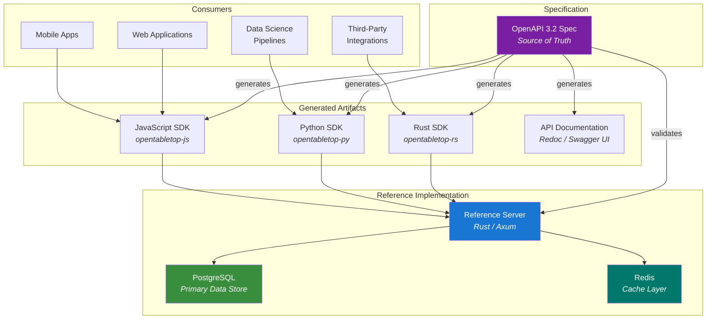

# System Overview

OpenTabletop is a specification-first project. The OpenAPI document is the canonical source of truth, and everything else — the reference server, SDKs, documentation — is derived from or validated against that specification. This page describes the overall system architecture.

## Architecture Diagram

> **Note:** The diagram above shows the reference implementation. SDKs work with any server that conforms to the OpenAPI specification — the reference server is one such implementation, not a central service.

## Spec-First Design

The specification is written before any implementation code. The workflow:

1. **Design the API** by authoring the OpenAPI document. Endpoints, schemas, examples, and constraints are defined in YAML.
2. **Generate artifacts** from the spec: SDKs, documentation, mock servers, and contract tests.
3. **Implement the server** to satisfy the contract. The reference server is validated against the spec using contract testing — if the server returns a response that does not match the spec schema, the test fails.
4. **Evolve the spec** through the RFC process. Changes to the spec drive changes to the implementation, not the other way around.

This ensures the specification is always correct and complete. The implementation cannot drift from the contract because the contract is tested continuously.

## Reference Server

The reference server is a Rust application built on [Axum](https://github.com/tokio-rs/axum), a modern async web framework. It is the official, maintained implementation of the OpenTabletop specification.

**Why Rust:**
- Performance: The filtering engine must evaluate complex multi-dimensional queries across large datasets. Rust's zero-cost abstractions and lack of garbage collection pauses make it ideal for consistent, low-latency responses.
- Correctness: Rust's type system catches entire classes of bugs at compile time. For a specification-grade implementation, correctness is paramount.
- Memory safety: No buffer overflows, no use-after-free, no data races. Critical for a public-facing API server.
- Ecosystem: Axum, SQLx (async PostgreSQL), Tower (middleware), Tokio (async runtime) form a mature, production-ready stack.

**Why Axum specifically:**
- Built on Tower and Hyper, the most battle-tested HTTP stack in the Rust ecosystem.
- Ergonomic handler types with compile-time route checking.
- Native support for OpenTelemetry, graceful shutdown, and middleware composition.

## Data Store

**PostgreSQL** is the primary data store. The data model maps directly to relational tables:

- `games` table with indexed columns for every filterable field.
- `game_relationships` table with foreign keys to `games`.
- `player_count_polls` table with composite primary key `(game_id, player_count)`.
- `expansion_combinations` table with a JSONB column for the expansion ID set and indexed effective properties.
- `mechanics`, `categories`, `themes` as controlled vocabulary tables with many-to-many join tables.
- `people`, `organizations` with role-typed join tables.

**Why PostgreSQL:**
- The data model is inherently relational. Games have relationships to other games, to people, to organizations, to taxonomy terms. Joins are the natural query pattern.
- PostgreSQL's query planner handles the multi-dimensional filter queries well with appropriate indexes (GIN for array fields, B-tree for range fields, GiST for full-text search).
- JSONB columns provide flexibility for semi-structured data (expansion combination metadata, export manifests) without sacrificing query performance.
- PostgreSQL is free, open source, and the most widely deployed relational database in the world.

**Redis** provides an optional caching layer for:
- Expensive effective-mode queries that are frequently repeated.
- Export manifests.
- Rate limiting counters.

Redis is not required. The reference server operates correctly without it, at the cost of higher latency for cache-eligible queries.

## SDKs

Generated SDKs provide idiomatic client libraries for the three most common consumer languages:

| SDK | Language | Package | Generator |
|-----|----------|---------|-----------|
| `opentabletop-rs` | Rust | crates.io | openapi-generator + manual refinement |
| `opentabletop-py` | Python | PyPI | openapi-generator + manual refinement |
| `opentabletop-js` | JavaScript/TypeScript | npm | openapi-generator + manual refinement |

SDKs are generated from the OpenAPI spec and then manually refined for ergonomics. The generation step ensures completeness (every endpoint and schema is covered); the manual refinement adds idiomatic patterns (builder APIs in Rust, async/await in Python, TypeScript types in JS).

Each SDK version declares which specification version it supports via a `spec-compatibility` metadata field. See [ADR-0005](../adr/0005-semantic-versioning.md).
