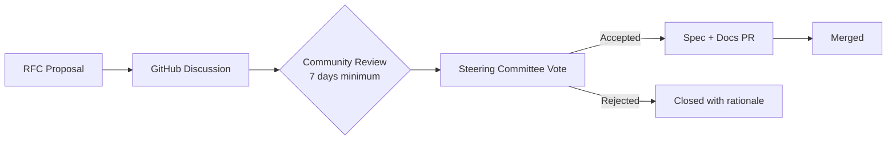

# Governance Model

OpenTabletop uses an RFC-based governance model designed to evolve with the project's maturity.

## Current Phase: Founder-Led (BDFL)

While the project has fewer than 10 active contributors, the founder makes final decisions on spec changes, ADRs, and project direction. This keeps velocity high during the bootstrap phase.

## Future Phase: Steering Committee

At 10+ active contributors, the project transitions to an elected steering committee:

- **5 members**, elected annually by active contributors
- **Staggered terms** -- 2-3 seats rotate each year for continuity
- **Decisions by majority vote** with the founder holding a tiebreaker vote during the first transition year
- **Geographic and linguistic diversity** -- the committee should aim to represent the international communities the specification serves, not just English-speaking contributors

## Language and Accessibility

OpenTabletop is a global standard. Contributions, discussions, and RFC proposals are welcome in any language. The core team will work with community translators to ensure key discussions are accessible across language boundaries. Non-English contributions are valued equally -- a Japanese developer's RFC is as valid as an English one.

## Decision Process

### Spec Changes (RFC Process)

Changes to the OpenAPI specification follow a formal RFC process:

1. **Propose**: Open a GitHub Discussion using the RFC template
2. **Discuss**: Minimum 7-day community review period
3. **Vote**: Steering committee (or BDFL) votes
4. **Implement**: Accepted RFCs require a PR with the spec change and updated documentation

### Architecture Decisions (ADRs)

Significant technical decisions are recorded as ADRs:

- Use `/create-adr` to propose a new decision
- ADRs start as `proposed`, move to `accepted` after review
- ADRs are immutable once accepted -- only the status field changes
- To change a decision, create a new ADR that supersedes the old one

### Taxonomy and Example Data Corrections

Corrections to the controlled vocabulary (mechanics, categories, themes) and spec example data use a lighter-weight process:

1. Open an issue using the **Data Correction** template
2. Provide source references
3. One maintainer verifies and merges

## Roles

| Role | Responsibility | How to earn |
|------|---------------|-------------|
| **Contributor** | Submit PRs, issues, RFCs | First merged PR |
| **Maintainer** | Review and merge PRs for a specific area | Consistent quality contributions + nomination |
| **Spec Maintainer** | Approve spec changes | Deep understanding of the data model + steering committee approval |
| **Steering Committee** | Vote on RFCs, resolve disputes, set project direction | Election by active contributors |
