# Implementing the Spec

OpenTabletop is a specification, not a product. This guide walks you through building a conforming server -- from exploring the spec to loading data to implementing the hard parts.

## Step 1: Explore the Specification

The OpenAPI 3.1 specification at `spec/openapi.yaml` is the source of truth. Start by browsing it interactively:

```sh
# Bundle the multi-file spec into a single file
./scripts/bundle-spec.sh

# Preview in Swagger UI (any static server works)
npx @redocly/cli preview-docs spec/bundled/openapi.yaml
```

This gives you a browsable view of every endpoint, schema, and parameter. Spend time here before writing code -- the spec is dense and the filtering model is unusually rich.

Key sections to read first:
- The `Game` schema -- the core entity with type discriminator, dual playtime, and community signals
- The `SearchRequest` schema -- the compound filtering model (this is where OpenTabletop differs most from other APIs)
- The `PlayerCountRating` schema -- per-count numeric ratings, not just min/max
- The `ExpansionCombination` and `PropertyModification` schemas -- the three-tier expansion resolution model

## Step 2: Design Your Database

The specification is format-agnostic, but most implementations will use a relational database. A recommended PostgreSQL schema is provided at [`data/samples/schema.sql`](https://github.com/tabletop-commons/OpenTabletop/blob/main/data/samples/schema.sql).

The schema covers:

```mermaid
erDiagram
    games ||--o{ game_mechanics : has
    games ||--o{ game_categories : has
    games ||--o{ game_themes : has
    games ||--o{ game_relationships : source
    games ||--o{ player_count_ratings : has
    games ||--o{ experience_playtime : has
    games ||--o{ expansion_combinations : base
    games ||--o{ property_modifications : base
    games ||--o{ game_credits : has
    games ||--o{ game_editions : has
    games ||--o{ game_awards : has
    games ||--o{ game_snapshots : has
    games ||--o{ external_identifiers : has
    games ||--o{ alternate_names : has
    games }o--o| games : parent
    mechanics ||--o{ game_mechanics : tagged
    categories ||--o{ game_categories : tagged
    themes ||--o{ game_themes : tagged
    people ||--o{ game_credits : credited
    publishers ||--o{ game_editions : publishes
    awards ||--o{ game_awards : given
```



To create the schema:

```sh
createdb opentabletop
psql opentabletop < data/samples/schema.sql
```

Key design decisions in the schema:
- **UUIDv7 primary keys** -- Time-ordered for index locality (ADR-0008)
- **Slugs as unique secondary keys** -- Immutable, URL-safe, used for API lookups
- **Junction tables for taxonomy** -- `game_mechanics`, `game_categories`, `game_themes` enable the AND/OR/NOT filtering
- **Separate `player_count_ratings` table** -- One row per (game, player_count) pair, not embedded JSON
- **`expansion_combinations` table** -- Explicit tier-1 records for the three-tier resolution model
- **Generated `tsvector` column** -- Full-text search across name and description (ADR-0027)

## Step 3: Load Sample Data

The `data/samples/` directory contains demonstration records for *Spirit Island* and *Terraforming Mars*. A loader script is provided:

```sh
# From the spec repository root (where package.json lives):
npm install

# Load into your database
node scripts/load-samples.js --connection "postgresql://localhost/opentabletop"

# Or dry-run to see the SQL without executing
node scripts/load-samples.js --dry-run
```

The loader reads the YAML files, maps them to the schema from Step 2, and inserts the records. It also loads the controlled vocabularies from `data/taxonomy/` (mechanics, categories, themes).

After loading, verify the data:

```sql
SELECT name, type, weight, average_rating FROM games;
SELECT g.name, pcr.player_count, pcr.average_rating
  FROM player_count_ratings pcr
  JOIN games g ON g.id = pcr.game_id
  ORDER BY g.name, pcr.player_count;
```

## Step 4: Implement Core Endpoints

Start with the read-only endpoints that don't involve complex logic:

1. **`GET /games`** -- List games with pagination. Use keyset (cursor-based) pagination, not offset-based (ADR-0012).
2. **`GET /games/{id}`** -- Single game by UUID or slug. Return the full `Game` schema.
3. **`GET /games/{id}/expansions`** -- List expansions for a base game. Filter `games` where `parent_game_id` matches.
4. **`GET /mechanics`**, **`GET /categories`**, **`GET /themes`** -- List taxonomy terms.

All list endpoints should return paginated responses with `_links` for navigation (ADR-0018) and support the `?include` parameter for embedding related resources (ADR-0017).

## Step 5: Implement the Hard Parts

### Compound Filtering

The `POST /games/search` endpoint accepts a `SearchRequest` body with up to 9 filter dimensions. The composition rules:

- **Cross-dimension**: AND (all active dimensions must be satisfied)
- **Within dimension**: OR (any value within one dimension matches)
- **Exclusion**: `_not` parameters remove matches

Example: "cooperative games, weight 2.5-3.5, best at exactly 4 players" requires joining across `games`, `game_mechanics`, and `player_count_ratings` in a single query. See [Filtering & Windowing](../pillars/filtering/overview.md) for the full model.

### Expansion-Aware Effective Mode

When `effective=true`, the API returns properties modified by expansions using the three-tier resolution model:

```
Tier 1: Look up ExpansionCombination record for the exact expansion set → use if found
Tier 2: Sum individual PropertyModification deltas → use as fallback
Tier 3: Return base game properties → lowest confidence
```

The response must include `resolution_tier` (1, 2, or 3) so consumers know how the effective properties were derived. See [ADR-0007](../adr/0007-combinatorial-expansion-property-model.md) and [Property Deltas](../pillars/data-model/property-deltas.md).

### Bulk Export

The `GET /export/games` endpoint streams JSON Lines or CSV. Key concerns:
- Streaming response (don't buffer the entire dataset in memory)
- Support the `include` parameter to control which nested data is included
- Generate an `ExportManifest` with checksums and metadata
- Rate limit to prevent abuse (ADR-0016 recommends 10 exports/hour per API key)

See [Data Export](../pillars/statistics/export.md) for the full specification.

## Step 6: Generate Client SDKs

Any OpenAPI-compatible code generator can produce client libraries from the spec:

| Generator | Languages | Command |
|-----------|-----------|---------|
| [openapi-generator](https://openapi-generator.tech/) | 50+ (Rust, Python, TypeScript, Java, Go, ...) | `openapi-generator-cli generate -i spec/bundled/openapi.yaml -g python -o my-sdk/` |
| [oapi-codegen](https://github.com/oapi-codegen/oapi-codegen) | Go | `oapi-codegen -package api spec/bundled/openapi.yaml > api.gen.go` |
| [openapi-typescript](https://github.com/openapi-ts/openapi-typescript) | TypeScript | `npx openapi-typescript spec/bundled/openapi.yaml -o schema.d.ts` |

## Step 7: Validate Conformance

To verify your implementation conforms to the spec:

1. **Schema validation** -- Ensure your API responses match the schemas in `spec/schemas/`
2. **Endpoint coverage** -- Implement the paths defined in `spec/paths/`
3. **Pagination** -- Use keyset (cursor-based) pagination per ADR-0012
4. **Error format** -- Return RFC 9457 Problem Details per ADR-0015
5. **Filtering semantics** -- AND across dimensions, OR within dimensions, NOT via `_not` parameters
6. **Sample data round-trip** -- Load the sample data, query it through your API, and verify the response shapes match the spec examples

A formal conformance test suite is a future goal (see [ADR-0045](../adr/0045-specification-only-repository.md)).

## Recommended Architecture

The ADRs in the [Infrastructure & Implementation Guidance](../adr/index.md) section document recommended patterns for production deployments:

- **Twelve-factor design** (ADR-0020) -- Config from environment, stateless processes, port binding
- **Container images** (ADR-0021) -- Distroless base images, multi-stage builds
- **Observability** (ADR-0023) -- Structured JSON logging, OpenTelemetry traces and metrics
- **Database** (ADR-0027, ADR-0029) -- PostgreSQL with full-text search, versioned SQL migrations
- **Caching** (ADR-0028) -- Cache-Control headers and ETags

These are recommendations, not requirements. A conforming server built with Django and MySQL is just as valid as one built with Axum and PostgreSQL, provided it implements the API contract correctly.

## Next: Deploying

Once your server is built and passing conformance checks, see the [Deploying & Operating](./deploying.md) guide for container images, Kubernetes manifests, database operations, observability setup, and production checklists.
