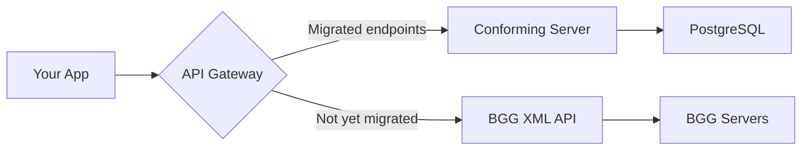

# Migrating from BGG

This guide maps BoardGameGeek XML API concepts to their OpenTabletop equivalents.

While this guide focuses on BGG as the most common migration source for English-speaking communities, OpenTabletop servers can be populated from any data source -- regional databases, publisher records, community curations, or other platforms. The specification is agnostic about data origin. If you are building a server for a non-English community using local data sources, the entity mapping principles here still apply even if the source system is not BGG.

## Strangler Fig Approach (ADR-0032)

You don't have to migrate all at once. The recommended pattern:



Route traffic through a gateway that sends requests to OpenTabletop for migrated endpoints and falls back to BGG for the rest. Migrate one endpoint at a time.

## Endpoint Mapping

| BGG XML API | OpenTabletop | Notes |
|-------------|---------------|-------|
| `GET /xmlapi2/thing?id=123` | `GET /games/{id}` or `GET /games/{slug}` | Use slug for human-readable URLs |
| `GET /xmlapi2/thing?id=123&type=boardgameexpansion` | `GET /games/{id}/expansions` | Type filtering built in |
| `GET /xmlapi2/search?query=spirit` | `GET /search?q=spirit` | Full-text search with typo tolerance |
| `GET /xmlapi2/hot?type=boardgame` | `GET /games?sort=trending&order=desc` | Trending sort option |
| `GET /xmlapi2/collection?username=foo` | `GET /users/{id}/collection` (future) | User data deferred to v2 |

## Field Mapping

| BGG Field | OpenTabletop Field | Notes |
|-----------|---------------------|-------|
| `@id` | `bgg_id` | Stored as cross-reference |
| `name[@type='primary']` | `name` | Primary name |
| `minplayers` | `min_players` | Same semantics |
| `maxplayers` | `max_players` | Same semantics |
| `poll[@name='suggested_numplayers']` | `GET /games/{id}/player-count-ratings` | Numeric 1-5 per-count ratings |
| `minplaytime` | `min_playtime` | Publisher-stated |
| `maxplaytime` | `max_playtime` | Publisher-stated |
| (not available) | `community_min_playtime`, `community_max_playtime` | Community-reported -- new |
| `statistics/ratings/averageweight` | `weight` | Same 1-5 scale |
| `statistics/ratings/average` | `rating` | Same scale |
| `link[@type='boardgamemechanic']` | `?include=mechanics` | Embedded via include param |
| `link[@type='boardgamecategory']` | `?include=categories` | Embedded via include param |
| `link[@type='boardgameexpansion']` | `GET /games/{id}/relationships?type=expands` | Typed relationship query |

## Key Differences

### XML vs JSON
BGG returns XML. Conforming OpenTabletop implementations return JSON with HAL-style `_links`.

### Polling vs Structured Data
BGG embeds poll data inline in the thing response as XML. The OpenTabletop specification defines player count ratings as a dedicated endpoint with a numeric 1-5 scale per count -- each player count has an independent average rating, vote count, and standard deviation. This replaces BGG's three-tier Best/Recommended/Not Recommended model ([ADR-0043](../adr/0043-player-count-sentiment-model-improvements.md)).

### No Expansion-Aware Filtering
BGG has no concept of filtering by expansion-modified properties. The specification's `effective=true` parameter is entirely new functionality.

### No Community Play Times
BGG tracks play logs but doesn't expose aggregated community play times through the API. The specification defines `community_min_playtime` and `community_max_playtime` as first-class fields, plus experience-adjusted playtime via `GET /games/{id}/experience-playtime`.

### Rate Limiting
BGG has undocumented rate limits that change without notice. The specification defines explicit tiered limits (60/min public, 600/min authenticated) with standard `X-RateLimit-*` headers.

## Cross-Referencing

The specification includes a `bgg_id` field on every game entity for cross-referencing. You can look up games by BGG ID on any conforming server:

```bash
# Find a game by its BGG ID (using the reference implementation)
curl "https://api.opentabletop.org/v1/games?bgg_id=162886"
```

This makes it straightforward to maintain a mapping between BGG and any OpenTabletop-conforming system during migration.
