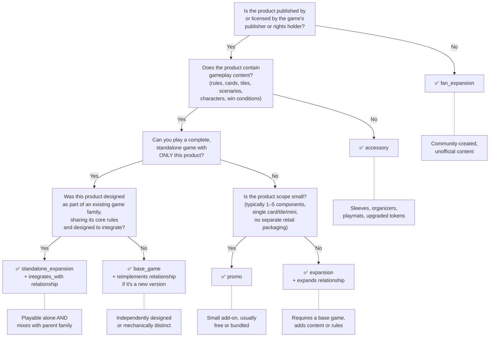
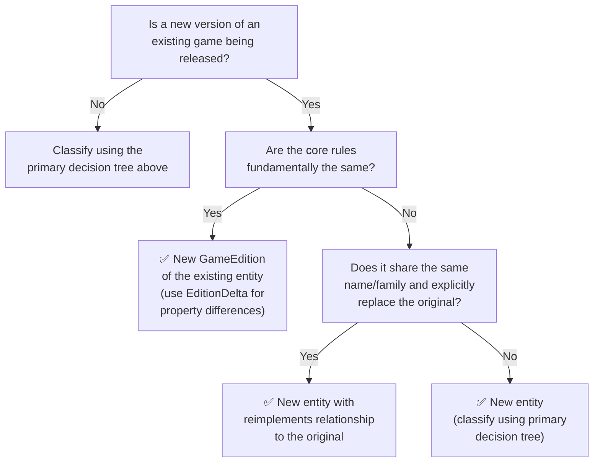

# Entity Type Classification Criteria

This document provides the decision framework for classifying board game products into the six OpenTabletop entity types and for determining when a product should be a new entity versus an edition of an existing one. Use this guide when proposing new entities via RFC, reviewing data contributions, importing data from BGG, or resolving classification disputes.

## The Six Entity Types

| Type | Question it answers | Defining characteristic | Example |
|------|-------------------|------------------------|---------|
| `base_game` | Can you play a complete game with just this product? | Standalone, independently designed | *Catan*, *Spirit Island*, *Wingspan* |
| `expansion` | Does this require another product to play? | Adds content/rules to an existing game; not playable alone | *Spirit Island: Branch & Claw*, *Scythe: Invaders from Afar* |
| `standalone_expansion` | Is this playable alone AND part of an existing game family? | Shares a game family identity and is self-contained | *Dominion: Intrigue (2nd ed.)*, *Star Realms: Colony Wars* |
| `promo` | Is this a small promotional gameplay addition? | Small component count, contains gameplay content, typically free/bundled | *Azul: Special Factories Promo* |
| `accessory` | Is this a non-gameplay product associated with a game? | No gameplay content (sleeves, organizers, playmats, upgraded tokens) | *Terraforming Mars Playmat*, *Wingspan Neoprene Mat* |
| `fan_expansion` | Is this unofficial community-created content? | Not published by or licensed by the game's publisher | *Gloomhaven: Homebrew Class Pack (fan)* |

## Primary Decision Tree

Use this flowchart when classifying a product:

## Entity vs Edition Decision Tree

When a new version of an existing game is released, use this flowchart to determine whether it should be a new entity or a new edition of the existing entity. See [ADR-0035](../../adr/0035-edition-level-property-deltas.md) for the edition data model.

**The core rules test**: If a player who knows the old version could sit down at the new version and play correctly after a brief explanation of changes, they are editions of the same entity. If the rules teaching is essentially from scratch, they are different entities.

## Worked Examples — Clear Cases

- **Spirit Island** — Standalone game, independently designed. -> `base_game`
- **Spirit Island: Branch & Claw** — Requires Spirit Island to play, adds events/spirits/tokens. -> `expansion`
- **Horizons of Spirit Island** — Playable alone, shares Spirit Island family, simplified rules, designed to integrate. -> `standalone_expansion`
- **Spirit Island: Promo Pack 1** — Two promo spirits, small scope, bundled with preorders. -> `promo`
- **Terraforming Mars Playmat** — No gameplay content, just a play surface. -> `accessory`
- **Gloomhaven: Homebrew Class Pack** — Not published by Cephalofair. -> `fan_expansion`
- **Samurai (2015 FFG reprint)** — Same core rules as 1998 original, improved components. -> New `GameEdition`, not a new entity.

## Worked Examples — Grey Zone Cases

### Grey Zone 1: promo vs accessory

**Catan: Oil Springs** — A scenario tile that adds new rules, a new resource type, and a new victory condition path. Even though it is a single tile, the presence of gameplay rules makes it a `promo`, not an `accessory`.

**Contrast**: "Catan Dice Tower" — a physical component with no new rules. -> `accessory`.

**The test**: Does the product add new rules, new decision points, new win conditions, or new player options? If yes, it contains gameplay content and is NOT an accessory.

### Grey Zone 2: expansion vs standalone_expansion

**Dominion: Intrigue (2nd Edition)** — Can be played as a complete game by itself (it includes base cards) AND can be mixed with other Dominion sets. -> `standalone_expansion`.

**Contrast**: "Dominion: Seaside" cannot be played without base cards from Dominion or Intrigue. -> `expansion`.

**The test**: Open the box. Can you play a complete game tonight with nothing else? The presence of a "basic" or "starter" mode does not count — the full game must be playable.

### Grey Zone 3: base_game vs standalone_expansion

**Pandemic Legacy: Season 2** — Playable alone and shares the Pandemic family name. But it was designed as an independent game with its own rules and story arc, not as a variant of the original Pandemic. The family connection is branding, not mechanical dependency. -> `base_game` with a `recommends` relationship to Season 1.

**Contrast**: "Star Realms: Colony Wars" — same core rules as Star Realms, explicitly designed to be mixed with it, compatible card pool. -> `standalone_expansion`.

**The test**: A `standalone_expansion` must satisfy BOTH conditions: (a) self-sufficient, AND (b) mechanically designed to integrate with an existing game family (shared card pool, compatible components, explicit mix-and-match design). Games that merely share thematic branding but are mechanically independent are `base_game`.

### Grey Zone 4: new entity vs new edition

**Tigris & Euphrates (1997) vs Yellow & Yangtze (2018)** — Different core mechanics (hexes vs squares, different scoring, different tile placement rules). Even though the designer describes Y&Y as a spiritual successor, the rules are substantially different. -> New entity (`base_game`) with `reimplements` relationship.

**Contrast**: "Carcassonne (2014 new art edition)" — same tile placement, same scoring, updated art and minor rule clarifications. -> New `GameEdition` with EditionDelta.

**The test**: Could a player of the original sit down and play correctly after a 2-minute delta explanation? If yes, it's an edition. If the rules teaching is essentially from scratch, it's a new entity.

### Grey Zone 5: expansion vs fan_expansion

**Root: The Clockwork Expansion** — Published by Leder Games (the publisher of Root). -> `expansion`.

**Contrast**: A homebrew Root faction posted on BGG as a print-and-play PDF by a community member. -> `fan_expansion`.

**The test**: Is the content published by, or formally licensed by, the original game's publisher or rights holder? If a fan expansion is later officially published, it transitions from `fan_expansion` to `expansion` (tracked via data correction workflow per [ADR-0030](../../adr/0030-structured-data-contributions.md)).

### Grey Zone 6: big promo vs small expansion

**Azul: Special Factories Promo (1 tile)** — Free convention handout, single component, no packaging. -> `promo`.

**Contrast**: "Wingspan: Oceania Expansion (95 cards, new boards, new food tokens)" — separately purchased, has its own box, multiple components, retail product. -> `expansion`.

**The test**: A promo is typically free or bundled, 1-5 components, no box, no separate retail SKU. An expansion is separately purchased, has its own packaging, multiple components, and a retail presence. The 5-component guideline is a soft threshold — a 3-card promo pack is a `promo`; a 3-card expansion with its own box, rulebook, and retail SKU is an `expansion`.

## Grey Zone Rules

1. **Gameplay content test (promo vs accessory)**: If the product adds new rules, new decision points, new win conditions, or new player options, it contains gameplay content and is NOT an `accessory`. Upgraded components (metal coins, custom dice, playmats) that do not change gameplay are accessories.

2. **Self-sufficiency test (expansion vs standalone_expansion)**: Can a person who has never purchased the parent game play a complete game session with only this product? If yes -> `standalone_expansion`. If no -> `expansion`. The presence of a "basic" or "starter" mode does not count — the full game must be playable.

3. **Family identity test (base_game vs standalone_expansion)**: A `standalone_expansion` must satisfy BOTH conditions: (a) self-sufficient (passes the self-sufficiency test above), AND (b) mechanically designed to integrate with or extend an existing game family (shared card pool, compatible components, explicit mix-and-match design). Games that merely share thematic branding but are mechanically independent are `base_game` with appropriate relationships.

4. **Core rules test (new entity vs new edition)**: If the core gameplay loop, primary mechanics, and victory conditions are substantially the same, it is a new `GameEdition`. If any of these are fundamentally different, it is a new entity. "Substantially the same" means a player of the original could play the new version after a brief explanation of changes. "Fundamentally different" means the game requires fresh teaching.

5. **Publisher authority test (expansion vs fan_expansion)**: Published by or formally licensed by the game's publisher or rights holder -> `expansion` (or `promo`). All other community-created content -> `fan_expansion`. License status is determined by explicit publisher acknowledgment, not by marketplace availability.

6. **Scope test (promo vs expansion)**: Promos are small-scope additions (typically 1-5 components, no separate packaging, often distributed as convention freebies or Kickstarter stretch goals). Expansions have their own packaging, retail presence, and larger component count. When scope is ambiguous, prefer `promo` for content distributed free/bundled and `expansion` for separately purchased content.

7. **When in doubt, prefer the more specific type.** If a product could be either `base_game` or `standalone_expansion`, and it clearly belongs to a game family, prefer `standalone_expansion`. The more specific classification carries more information.

## BGG Migration Rules

BGG uses `boardgame`, `boardgameexpansion`, and `boardgameaccessory` as its type system — much coarser than OpenTabletop's six types. These rules guide the import pipeline ([ADR-0032](../../adr/0032-strangler-fig-legacy-migration.md)).

| BGG type | Determination logic | OpenTabletop type |
|----------|-------------------|-------------------|
| `boardgame` | Default | `base_game` |
| `boardgame` with `reimplements` link, same publisher | Core rules differ? Keep as `base_game` + `reimplements`. Core rules same? Flag for manual review as potential `GameEdition`. | `base_game` or `GameEdition` (manual review) |
| `boardgameexpansion` with `requires` link | Standard expansion | `expansion` |
| `boardgameexpansion` without `requires` link | Likely standalone — verify via self-sufficiency test | `standalone_expansion` (verify) |
| `boardgameexpansion` with very low component count, no retail listing | Likely promo — verify via scope test | `promo` (verify) |
| `boardgameaccessory` | Check if it contains gameplay content (rules in description) | `accessory` (or `promo` if gameplay content found) |
| Any BGG type, fan-created | Check publisher field against parent game publisher | `fan_expansion` if no publisher match |

### Key migration principles

- **No `standalone_expansion` in BGG.** These are listed as either `boardgame` or `boardgameexpansion` on BGG. During import, any `boardgameexpansion` that lacks a `requires` link should be flagged for self-sufficiency review.
- **No promo/expansion distinction in BGG.** Both are `boardgameexpansion`. Use component count and distribution method as heuristics, but flag ambiguous cases for human review.
- **No edition system in BGG.** When multiple BGG entries represent different editions of the same game (discoverable via `reimplements` links between entries with very similar names), the import pipeline should create one `Game` entity with multiple `GameEdition` records, keeping the highest-rated or most-voted entry as the canonical edition.

## RFC Reviewer Checklist

When evaluating a proposed entity addition or type classification:

- [ ] **Decision tree**: Does the entity pass the primary decision tree flowchart?
- [ ] **Self-sufficiency verified**: If typed as `base_game` or `standalone_expansion`, has someone confirmed it is playable alone?
- [ ] **Family identity checked**: If typed as `standalone_expansion`, is the game family identified and the integration mechanism described?
- [ ] **Edition check**: Could this entity be an edition of an existing entity? Has the core rules test been applied?
- [ ] **Publisher authority**: If typed as anything other than `fan_expansion`, is the publisher or license confirmed?
- [ ] **Scope check**: If typed as `promo`, is the component count small (typically 1-5) and the product non-retail?
- [ ] **Relationships created**: Are the appropriate typed relationships ([ADR-0011](../../adr/0011-typed-game-relationships.md)) created alongside the entity? (e.g., `expands` for expansions, `reimplements` for re-releases, `integrates_with` for standalone expansions)
- [ ] **BGG cross-reference**: If a BGG ID exists, does the chosen type align with or justifiably differ from BGG's classification?
- [ ] **Grey zone documented**: If the classification involves a grey zone judgment, is the rationale documented in the entity's notes or the RFC discussion?
