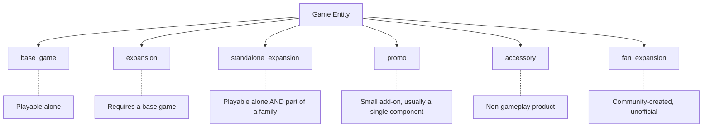

# Game Entity

The `Game` entity is the core of the data model. Every board game, expansion, promo, and accessory is represented as a Game with a `type` discriminator that indicates its role.

## Fields

| Field | Type | Required | Description |
|-------|------|----------|-------------|
| `id` | UUIDv7 | yes | Primary identifier, time-sortable |
| `slug` | string | yes | URL-safe human-readable identifier (e.g., `spirit-island`) |
| `name` | string | yes | Primary display name |
| `type` | enum | yes | Game type discriminator (see below) |
| `description` | string | no | Full text description |
| `year_published` | integer | no | Year of first publication |
| `min_players` | integer | no | Publisher-stated minimum player count |
| `max_players` | integer | no | Publisher-stated maximum player count |
| `min_playtime` | integer | no | Publisher-stated minimum play time in minutes |
| `max_playtime` | integer | no | Publisher-stated maximum play time in minutes |
| `community_min_playtime` | integer | no | Community-reported minimum play time in minutes |
| `community_max_playtime` | integer | no | Community-reported maximum play time in minutes |
| `weight` | float | no | Community-voted complexity weight (1.0 - 5.0 scale) |
| `weight_votes` | integer | no | Number of weight votes cast |
| `rating` | float | no | Community average rating (1.0 - 10.0 scale) |
| `rating_votes` | integer | no | Number of rating votes cast |
| `image_url` | string | no | URL to the primary box art image |
| `thumbnail_url` | string | no | URL to a thumbnail version of the box art |
| `created_at` | datetime | yes | When this record was created (ISO 8601) |
| `updated_at` | datetime | yes | When this record was last modified (ISO 8601) |

## Type Discriminator

The `type` field classifies what kind of product this Game represents:

| Type | Description | Example |
|------|-------------|---------|
| `base_game` | A standalone game that can be played without any other product | *Wingspan*, *Catan*, *Spirit Island* |
| `expansion` | Requires a base game to play; adds content or rules | *Wingspan: European Expansion*, *Branch & Claw* |
| `standalone_expansion` | Part of a game family but playable on its own | *Horizons of Spirit Island*, *Star Realms: Colony Wars* |
| `promo` | A small promotional addition, typically a single card or tile | *Wingspan: Duet Promo Pack* |
| `accessory` | A non-gameplay product associated with a game (sleeves, organizer, playmat) | *Wingspan Neoprene Playmat* |
| `fan_expansion` | Community-created content, not officially published | *Spirit Island: Feather & Flame (fan)* |

### Type Hierarchy



## Dual Playtime Fields

The Game entity carries two sets of playtime fields, reflecting the reality that publisher estimates and actual play times often diverge significantly:

- **`min_playtime` / `max_playtime`**: What the publisher prints on the box. These tend to be optimistic and assume experienced players. A game listed as "60-90 minutes" often takes 120+ minutes for a first play.
- **`community_min_playtime` / `community_max_playtime`**: Derived from community-reported play logs. These reflect what players actually experience. See [Play Time Model](./playtime.md) for details on how these are computed.

Both sets of fields are available for filtering. The `playtime_source` filter parameter controls which set is used. See [Filter Dimensions](../filtering/dimensions.md).

## Weight and Rating

**Weight** is a community-voted measure of complexity on a 1.0 to 5.0 scale:

| Range | Interpretation | Examples |
|-------|----------------|----------|
| 1.0 - 1.5 | Very light — minimal rules, suitable for non-gamers | *Uno*, *Codenames* |
| 1.5 - 2.5 | Light — simple rules with some decisions | *Ticket to Ride*, *Azul* |
| 2.5 - 3.5 | Medium — meaningful strategic depth | *Wingspan*, *Everdell* |
| 3.5 - 4.5 | Heavy — complex rules and deep strategy | *Spirit Island*, *Terraforming Mars* |
| 4.5 - 5.0 | Very heavy — steep learning curve, long playtime | *Twilight Imperium*, *Mage Knight* |

The `weight_votes` field indicates how many community members contributed to the weight score. A weight of 3.5 with 5000 votes is far more reliable than 3.5 with 12 votes.

**Rating** is a community average on a 1.0 to 10.0 scale, with `rating_votes` tracking the sample size. The specification does not define a Bayesian average or geek rating equivalent — those are derived values that belong in application logic, not the data model. The raw average and vote count are the source data.

## Example

```json
{
  "id": "01967b3c-5a00-7000-8000-000000000001",
  "slug": "spirit-island",
  "name": "Spirit Island",
  "type": "base_game",
  "description": "Powerful spirits have existed on this island...",
  "year_published": 2017,
  "min_players": 1,
  "max_players": 4,
  "min_playtime": 90,
  "max_playtime": 120,
  "community_min_playtime": 90,
  "community_max_playtime": 150,
  "weight": 3.89,
  "weight_votes": 5127,
  "rating": 8.31,
  "rating_votes": 42891,
  "image_url": "https://images.opentabletop.org/spirit-island.jpg",
  "thumbnail_url": "https://images.opentabletop.org/spirit-island-thumb.jpg",
  "created_at": "2026-01-15T10:00:00Z",
  "updated_at": "2026-03-01T14:30:00Z"
}
```
