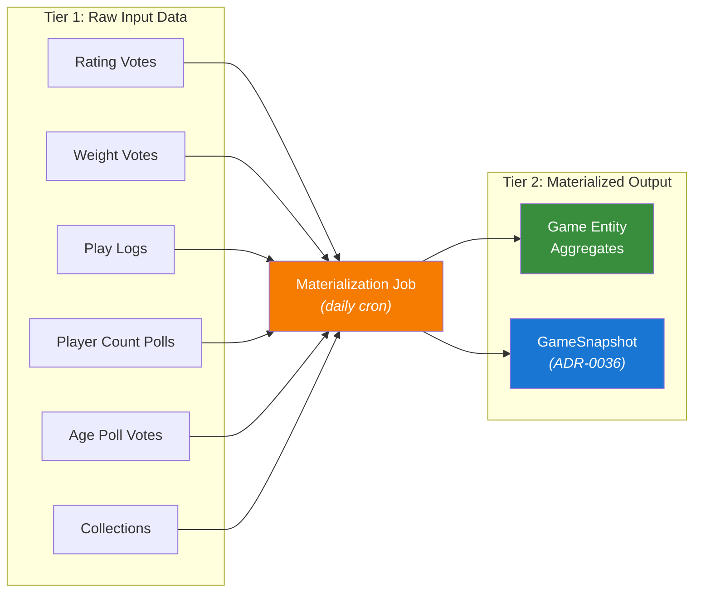

# Materialization

The OpenTabletop data model separates **raw input data** from **materialized aggregates**. This is a deliberate architectural decision, not an implementation detail. Understanding the two tiers explains why certain fields on the Game entity are not computed in real time, when they refresh, and how they relate to the snapshot infrastructure described in [ADR-0036](../../adr/0036-time-series-snapshots-and-trend-analysis.md).

## Two Data Tiers

### Tier 1: Raw Input Data

Raw input data is the individual, immutable records submitted by users and communities:

- **Rating votes** -- Individual 1-10 ratings with voter-declared scale preference (see [Rating Model](./rating-model.md))
- **Weight votes** -- Individual 1.0-5.0 complexity votes (see [Weight Model](./weight-model.md))
- **Play logs** -- Individual session records with duration, player count, and experience level
- **Player count poll responses** -- Per-count best/recommended/not-recommended votes (see [Player Count Model](./player-count.md))
- **Age poll votes** -- Individual suggested-age votes
- **Collection records** -- Per-user ownership, wishlist, and play status entries

These records are append-only. A new rating vote is inserted; it does not update a running total in place. This preserves the full distribution for statistical analysis and makes the raw data exportable (Pillar 3).

### Tier 2: Materialized Aggregates

Materialized aggregates are the derived fields that appear on the Game entity and related responses. They are computed periodically from Tier 1 data:

- Averages, counts, and distributions (e.g., `average_rating`, `rating_distribution`)
- Confidence scores that depend on global statistics
- Rankings that are relative to the entire dataset
- Bayesian priors that use global parameters
- Derived fields like `top_player_counts` and experience multipliers

These fields are **read-optimized snapshots** of computations over the raw data. They are not updated on every write to Tier 1.

## Why Not Real-Time

Computing aggregates on every incoming vote is wasteful and, for several fields, architecturally impossible without full table scans:

- **`rating_distribution`** across 50,000 votes requires reading every vote to build the histogram. Recomputing this on every new vote is O(n) per write instead of O(1).
- **`rating_confidence`** depends on the **global mean across all games** -- a single new vote on one game could theoretically shift the confidence score of every other game. Recomputing globally on every write is infeasible.
- **`rank_overall`** is a relative ordering of all games by `bayes_rating`. A single new vote that changes one game's Bayesian average requires re-sorting and re-ranking the entire dataset.
- **`bayes_rating`** uses a Dirichlet prior whose parameters are derived from the global rating distribution. The prior itself is a materialized value.
- **Experience multipliers** require grouping play logs by experience level and computing per-level medians -- an aggregation over the full play log table.

Batch materialization converts these from O(n) per write to O(n) per scheduled run, amortized across all writes in the interval. For a dataset with thousands of votes per day, this is the difference between seconds of compute per vote and seconds of compute per day.

## Materialization Schedule

The recommended default is **daily materialization**. This balances freshness against compute cost:

| Cadence | Fields | Rationale |
|---------|--------|-----------|
| **Daily** (recommended default) | `average_rating`, `rating_count`, `rating_distribution`, `rating_stddev`, `rating_confidence`, `bayes_rating`, `weight`, `weight_votes`, `community_playtime_*`, `community_suggested_age`, `owner_count`, `wishlist_count`, `total_plays`, `top_player_counts`, `recommended_player_counts`, experience multipliers | Most fields benefit from daily refresh. Vote volumes for any single game are low enough that daily captures the signal without waste. |
| **Weekly** (or less frequent) | `rank_overall` | Rankings are expensive to compute (full sort of all games) and consumers do not expect them to shift hour by hour. Weekly is sufficient for most use cases. |

The **`updated_at`** field on the Game entity indicates when aggregates were last refreshed. API consumers can check this timestamp to assess staleness. An `updated_at` of yesterday means the aggregates reflect all votes through yesterday's materialization run; votes submitted today are in Tier 1 but not yet reflected in Tier 2.

## Field-to-Source Mapping

Every materialized field on the Game entity traces back to a specific raw data source and a defined computation:

| Materialized Field | Raw Source | Computation |
|---|---|---|
| `average_rating` | `rating_votes` | Mean of all votes (normalized to 1-10) |
| `rating_count` | `rating_votes` | COUNT |
| `rating_distribution` | `rating_votes` | Histogram: count per 1-10 bucket |
| `rating_stddev` | `rating_votes` | Standard deviation |
| `rating_confidence` | `rating_votes` + global stats | f(count, distribution shape, deviation from global mean) |
| `bayes_rating` | `rating_votes` + global prior | Dirichlet-prior Bayesian average |
| `weight` | `weight_votes` | Mean |
| `weight_votes` (count) | `weight_votes` | COUNT |
| `community_playtime_*` | `play_logs` | 10th/50th/90th percentile |
| `community_suggested_age` | `age_poll_votes` | Median |
| `owner_count` | `collections` | COUNT WHERE status = 'owned' |
| `wishlist_count` | `collections` | COUNT WHERE status = 'wishlist' |
| `total_plays` | `play_logs` | SUM |
| `rank_overall` | All `bayes_rating` values | Sort + assign ordinal |
| `top_player_counts` | `player_count_ratings` | Counts where avg >= threshold |
| `recommended_player_counts` | `player_count_ratings` | Counts where avg >= lower threshold |
| Experience multipliers | `play_logs` grouped by level | Per-level median / experienced median |

For the detailed specification of each field, see: [Rating Model](./rating-model.md), [Weight Model](./weight-model.md), [Player Count Model](./player-count.md), [Play Time Model](./playtime.md).

## Data Flow

The materialization pipeline is a scheduled batch process that reads Tier 1, computes Tier 2, and writes the results back to the Game entity:

## GameSnapshot as Materialization Artifact

The [GameSnapshot](../../adr/0036-time-series-snapshots-and-trend-analysis.md) schema exists to enable longitudinal trend analysis -- tracking how a game's rating, rank, and activity metrics change over time. The materialization job is the natural place to capture these snapshots.

When the daily materialization runs:

1. Raw votes are aggregated into the Game entity's materialized fields (Tier 2).
2. The freshly-computed aggregates are copied into a new `GameSnapshot` record timestamped to the current run.

The snapshot **is** the materialized state at that point in time. There is no separate "snapshot job" -- the snapshot is a side effect of materialization. This guarantees that the snapshot's `average_rating`, `bayes_rating`, `rank_overall`, and other fields are internally consistent (they were all computed from the same Tier 1 state in the same run).

This also means snapshot frequency is tied to materialization frequency. If you materialize daily, you get daily snapshots. If you materialize weekly, you get weekly snapshots. The [Trend Analysis](../statistics/trends.md) documentation covers how these snapshots power longitudinal queries.

For implementations that want less frequent snapshots (e.g., monthly) but daily materialization, the job can conditionally emit a snapshot only on the first run of each month. The materialization itself still runs daily to keep Game entity aggregates fresh.
