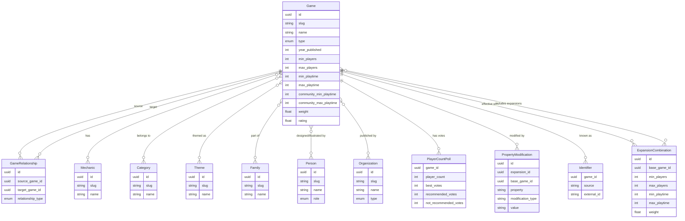

# Pillar 1: Standardized Data Model

The data model is the foundation of OpenTabletop. It defines every entity, relationship, and data type in the specification. The goal is a schema rigorous enough for a relational database, expressive enough to capture the full complexity of board game metadata, and stable enough that implementations can rely on it for years.

## Entity-Relationship Overview

## Entity Summary

| Entity | Description |
|--------|-------------|
| **Game** | The core entity. Represents a base game, expansion, standalone expansion, promo, accessory, or fan expansion. See [Game Entity](./games.md). |
| **GameRelationship** | Typed, directed edges between games: expands, reimplements, contains, requires, recommends, integrates_with. See [Game Relationships](./relationships.md). |
| **PropertyModification** | How a single expansion changes a single property of its base game (e.g., "+2 max players"). See [Property Deltas](./property-deltas.md). |
| **ExpansionCombination** | Pre-computed effective properties for a specific set of expansions combined with a base game. See [Property Deltas](./property-deltas.md). |
| **Mechanic** | A controlled vocabulary term describing a game mechanism (e.g., "deck-building", "worker-placement"). See [Taxonomy](./taxonomy.md). |
| **Category** | A controlled vocabulary term for game classification (e.g., "strategy", "party", "war"). See [Taxonomy](./taxonomy.md). |
| **Theme** | A controlled vocabulary term for thematic setting (e.g., "fantasy", "space", "historical"). See [Taxonomy](./taxonomy.md). |
| **Family** | A named grouping of related games (e.g., "*Catan*", "*Pandemic Legacy*"). See [Taxonomy](./taxonomy.md). |
| **Person** | A designer, artist, or other credited individual. See [People & Organizations](./people.md). |
| **Organization** | A publisher, manufacturer, or distributor. See [People & Organizations](./people.md). |
| **PlayerCountPoll** | Community vote data for each supported player count. See [Player Count Model](./player-count.md). |
| **Identifier** | Cross-reference IDs linking to external systems (BGG, Frosthaven app, etc.). See [Identifiers](./identifiers.md). |

## Design Principles

**Explicit over implicit.** Every relationship is a first-class entity with a type discriminator, not an implied association.

**Dual-source data.** Wherever community perceptions differ from publisher-stated values, both are captured. Publisher-stated play time and community-reported play time are separate fields, not averaged into one. Both sources carry their own biases -- see [Data Provenance & Bias](./data-provenance.md).

**Combinatorial awareness.** The data model does not just store "this expansion exists." It stores how that expansion changes the base game's properties, and it supports pre-computed combinations for sets of expansions. This is what makes [effective mode filtering](../filtering/effective-mode.md) possible.

**Controlled vocabulary with governance.** Mechanics, categories, and themes are not free-text tags. They are managed terms with slugs, definitions, and an RFC process for additions. This prevents the fragmentation problem where "deck building" and "deckbuilding" and "deck-building" are three different tags.

**Stable identifiers.** Every entity has a UUIDv7 (time-sortable, globally unique) and a human-readable slug. External cross-references (BGG IDs, etc.) are stored as structured Identifier entities, not ad-hoc fields.
