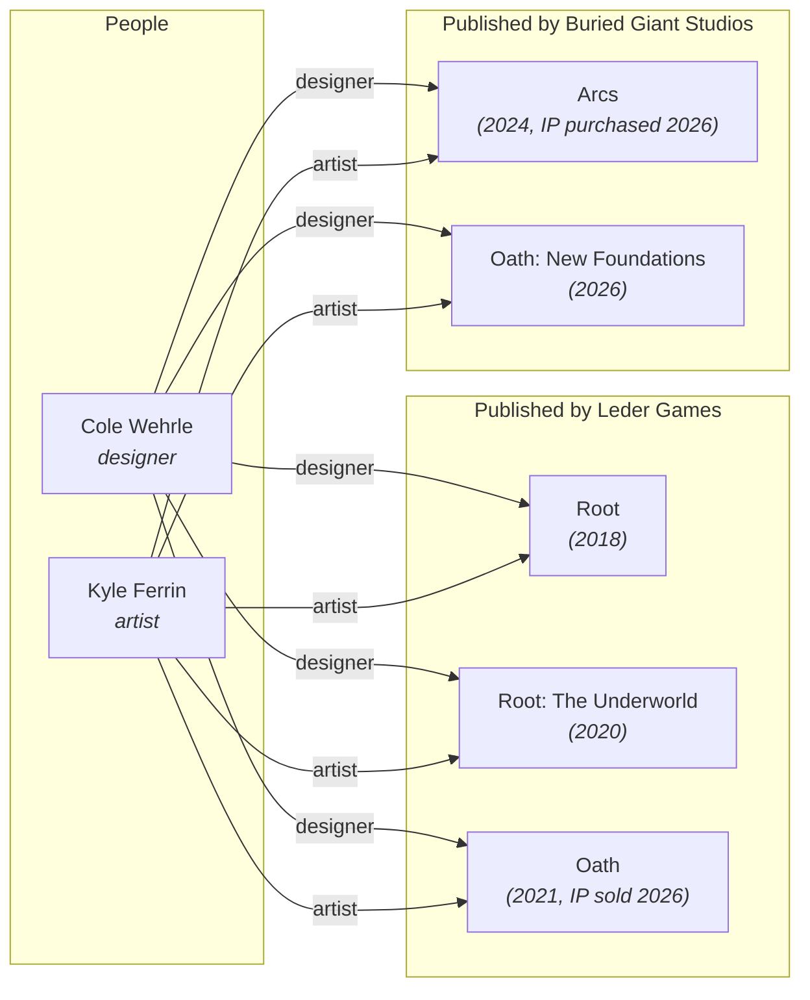

# People & Organizations

Board games are created by people and published by organizations. The data model captures both with explicit, many-to-many relationships to games.

## Person Entity

A `Person` represents an individual who contributed to a game's creation.

| Field | Type | Required | Description |
|-------|------|----------|-------------|
| `id` | UUIDv7 | yes | Primary identifier |
| `slug` | string | yes | URL-safe name (e.g., `cole-wehrle`) |
| `name` | string | yes | Display name (e.g., "Cole Wehrle") |
| `created_at` | datetime | yes | When this record was created |
| `updated_at` | datetime | yes | When this record was last modified |

## Game-Person Relationships

The association between a game and a person includes a **role** that specifies the nature of their contribution:

| Field | Type | Required | Description |
|-------|------|----------|-------------|
| `game_id` | UUIDv7 | yes | The game |
| `person_id` | UUIDv7 | yes | The person |
| `role` | enum | yes | The contribution type |

### Roles

| Role | Description | Example |
|------|-------------|---------|
| `designer` | Created the game's rules and mechanics | Cole Wehrle designed *Root* |
| `artist` | Created the visual art and graphic design | Kyle Ferrin illustrated *Root* |
| `developer` | Refined and balanced the design (distinct from designer) | A playtesting lead who shaped the final product |
| `writer` | Authored narrative or flavor text | The lore writer for a campaign-driven game |
| `graphic_designer` | Designed the layout, iconography, and visual system | Distinct from the illustrator; focuses on usability |

A person can have multiple roles on the same game. A single individual might be both `designer` and `developer`, and those are recorded as two separate associations.

### Many-to-Many

The relationship is fully many-to-many:

- A game can have multiple designers: *Pandemic* is designed by Matt Leacock (solo), but *7 Wonders Duel* is designed by Antoine Bauza and Bruno Cathala.
- A person can design multiple games: Uwe Rosenberg designed *Agricola*, *Caverna*, *A Feast for Odin*, *Patchwork*, and dozens more.



The same people (Cole Wehrle, Kyle Ferrin) appear on games across two different publishers. The person entities stay the same -- only the game-organization relationships change. This is why people and organizations are modeled independently rather than nesting people under their publisher.

## Organization Entity

An `Organization` represents a company involved in bringing a game to market.

| Field | Type | Required | Description |
|-------|------|----------|-------------|
| `id` | UUIDv7 | yes | Primary identifier |
| `slug` | string | yes | URL-safe name (e.g., `leder-games`) |
| `name` | string | yes | Display name (e.g., "Leder Games") |
| `type` | enum | yes | Organization type (see below) |
| `website` | string | no | Primary website URL |
| `country` | string | no | ISO 3166-1 alpha-2 country code |
| `created_at` | datetime | yes | When this record was created |
| `updated_at` | datetime | yes | When this record was last modified |

### Organization Types

| Type | Description |
|------|-------------|
| `publisher` | The company that finances, produces, and distributes the game |
| `manufacturer` | The company that physically produces the game components |
| `distributor` | The company that handles logistics and retail placement |
| `licensor` | The company that owns the IP being licensed for the game |

### Game-Organization Relationships

| Field | Type | Required | Description |
|-------|------|----------|-------------|
| `game_id` | UUIDv7 | yes | The game |
| `organization_id` | UUIDv7 | yes | The organization |
| `role` | enum | yes | `publisher`, `manufacturer`, `distributor`, or `licensor` |
| `region` | string | no | ISO 3166-1 alpha-2 code for regional publishing rights |
| `year` | integer | no | Year this organization's edition was published |

A game commonly has multiple publishers for different regions:

- *Root* is published by Leder Games (US), Matagot (France), Schwerkraft-Verlag (Germany), and others.

The `region` field disambiguates which publisher is responsible for which market. The `year` field handles cases where publishing rights change over time.

### Publisher Transitions

Publishing relationships are not permanent. Designers move between studios, and new expansions for an existing game family may ship under a different publisher. The data model must capture this without rewriting history.

**Case study: Leder Games -> Buried Giant Studios.** Cole Wehrle and Kyle Ferrin were the lead designer and artist at Leder Games (founded by Patrick Leder), where they created *Root* (2018), *Oath* (2021), and *Arcs* (2024). In January 2026, [Wehrle announced](https://ledergames.com/blogs/news/a-letter-from-cole-wehrle) that he and Ferrin were leaving to form [Buried Giant Studios](https://www.wargamer.com/board-games/buried-giant-cole-wehrle), joined by Drew Wehrle, Ted Caya, Josh Yearsley, and other longtime collaborators.

Crucially, Buried Giant **purchased** the rights to both *Oath* and *Arcs* from Leder Games outright -- this is a full IP transfer, not a license. *Root* remains at Leder Games. The [Oath: New Foundations Kickstarter](https://www.kickstarter.com/projects/2074786394/oath-new-foundations/posts/4585911) (funded mid-2024) is now fulfilled by Buried Giant.

In the data model, this produces the following game-organization records:

| game | organization | role | year |
|------|-------------|------|------|
| *Root* | Leder Games | `publisher` | 2018 |
| *Oath* | Leder Games | `publisher` | 2021 |
| *Arcs* | Leder Games | `publisher` | 2024 |
| *Oath: New Foundations* | Buried Giant Studios | `publisher` | 2026 |

Note that *Oath* and *Arcs* retain their original Leder Games publisher records -- that is historical fact. The IP transfer does not rewrite history; it means new products in those families are published by Buried Giant. The person records (Cole Wehrle, Kyle Ferrin) are unchanged across both eras -- they are credited on Leder-era and Buried Giant-era games through the same person entities. This is a key reason why people are modeled independently from organizations: a designer's body of work spans their entire career, not just their tenure at one company.

## Querying

### Get all games by a designer

```http
GET /people/cole-wehrle/games?role=designer
```

Returns all games where Cole Wehrle is credited as designer -- spanning both the Leder Games and Buried Giant Studios eras.

```json
{
  "data": [
    {
      "id": "01912f4c-a1b2-7c3d-8e4f-5a6b7c8d9e0f",
      "slug": "root",
      "name": "Root",
      "type": "base_game",
      "year_published": 2018,
      "role": "designer",
      "_links": {
        "self": { "href": "/games/root", "title": "Root" }
      }
    },
    {
      "id": "01912f4c-b2c3-7d4e-9f5a-6b7c8d9e0f1a",
      "slug": "oath",
      "name": "Oath: Chronicles of Empire and Exile",
      "type": "base_game",
      "year_published": 2021,
      "role": "designer",
      "_links": {
        "self": { "href": "/games/oath", "title": "Oath" }
      }
    },
    {
      "id": "01912f4c-c3d4-7e5f-af6b-7c8d9e0f1a2b",
      "slug": "arcs",
      "name": "Arcs",
      "type": "base_game",
      "year_published": 2024,
      "role": "designer",
      "_links": {
        "self": { "href": "/games/arcs", "title": "Arcs" }
      }
    },
    // ... Root: The Underworld Expansion, Root: The Marauder Expansion,
    //     Oath: New Foundations, Pax Pamir (Second Edition), etc.
  ],
  "_links": {
    "self": { "href": "/people/cole-wehrle/games?role=designer" }
  }
}
```

### Get all publishers for a game

```http
GET /games/root/organizations?role=publisher
```

Returns all organizations with a `publisher` role for Root, disambiguated by region and year.

```json
{
  "data": [
    {
      "organization_id": "01913e5a-1a2b-7c3d-8e4f-5a6b7c8d9e0f",
      "name": "Leder Games",
      "slug": "leder-games",
      "role": "publisher",
      "region": "US",
      "year": 2018,
      "_links": {
        "organization": { "href": "/organizations/leder-games", "title": "Leder Games" }
      }
    },
    {
      "organization_id": "01913e5a-2b3c-7d4e-9f5a-6b7c8d9e0f1a",
      "name": "Matagot",
      "slug": "matagot",
      "role": "publisher",
      "region": "FR",
      "year": 2019,
      "_links": {
        "organization": { "href": "/organizations/matagot", "title": "Matagot" }
      }
    },
    {
      "organization_id": "01913e5a-3c4d-7e5f-af6b-7c8d9e0f1a2b",
      "name": "Schwerkraft-Verlag",
      "slug": "schwerkraft-verlag",
      "role": "publisher",
      "region": "DE",
      "year": 2019,
      "_links": {
        "organization": { "href": "/organizations/schwerkraft-verlag", "title": "Schwerkraft-Verlag" }
      }
    }
    // ... additional regional publishers
  ],
  "_links": {
    "self": { "href": "/games/root/organizations?role=publisher" }
  }
}
```

### Get all artists who worked on games in a family

```http
GET /families/root/people?role=artist
```

Returns all people credited as artist on any game in the Root family.

```json
{
  "data": [
    {
      "id": "01913d4f-6f7a-7b8c-9d0e-1f2a3b4c5d6e",
      "slug": "kyle-ferrin",
      "name": "Kyle Ferrin",
      "role": "artist",
      "games": [
        { "slug": "root", "name": "Root" },
        { "slug": "root-the-underworld-expansion", "name": "Root: The Underworld Expansion" },
        { "slug": "root-the-marauder-expansion", "name": "Root: The Marauder Expansion" },
        { "slug": "root-the-homeland-expansion", "name": "Root: The Homeland Expansion" }
      ],
      "_links": {
        "self": { "href": "/people/kyle-ferrin", "title": "Kyle Ferrin" }
      }
    }
  ],
  "_links": {
    "self": { "href": "/families/root/people?role=artist" }
  }
}
```
