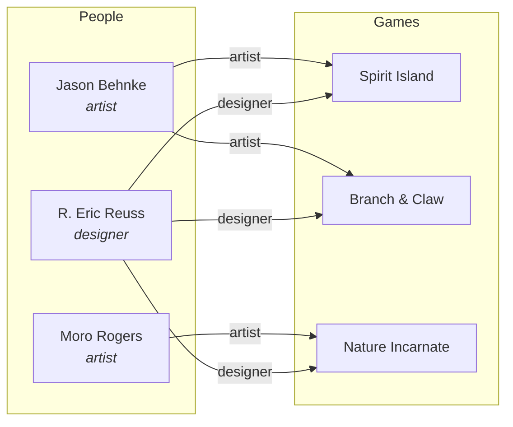

# People & Organizations

Board games are created by people and published by organizations. The data model captures both with explicit, many-to-many relationships to games.

## Person Entity

A `Person` represents an individual who contributed to a game's creation.

| Field | Type | Required | Description |
|-------|------|----------|-------------|
| `id` | UUIDv7 | yes | Primary identifier |
| `slug` | string | yes | URL-safe name (e.g., `r-eric-reuss`) |
| `name` | string | yes | Display name (e.g., "R. Eric Reuss") |
| `created_at` | datetime | yes | When this record was created |
| `updated_at` | datetime | yes | When this record was last modified |

## Game-Person Relationships

The association between a game and a person includes a **role** that specifies the nature of their contribution:

| Field | Type | Required | Description |
|-------|------|----------|-------------|
| `game_id` | UUIDv7 | yes | The game |
| `person_id` | UUIDv7 | yes | The person |
| `role` | enum | yes | The contribution type |

### Roles

| Role | Description | Example |
|------|-------------|---------|
| `designer` | Created the game's rules and mechanics | R. Eric Reuss designed *Spirit Island* |
| `artist` | Created the visual art and graphic design | Jason Behnke illustrated *Spirit Island* |
| `developer` | Refined and balanced the design (distinct from designer) | A playtesting lead who shaped the final product |
| `writer` | Authored narrative or flavor text | The lore writer for a campaign-driven game |
| `graphic_designer` | Designed the layout, iconography, and visual system | Distinct from the illustrator; focuses on usability |

A person can have multiple roles on the same game. A single individual might be both `designer` and `developer`, and those are recorded as two separate associations.

### Many-to-Many

The relationship is fully many-to-many:

- A game can have multiple designers: *Pandemic* is designed by Matt Leacock (solo), but *7 Wonders Duel* is designed by Antoine Bauza and Bruno Cathala.
- A person can design multiple games: Uwe Rosenberg designed *Agricola*, *Caverna*, *A Feast for Odin*, *Patchwork*, and dozens more.



## Organization Entity

An `Organization` represents a company involved in bringing a game to market.

| Field | Type | Required | Description |
|-------|------|----------|-------------|
| `id` | UUIDv7 | yes | Primary identifier |
| `slug` | string | yes | URL-safe name (e.g., `greater-than-games`) |
| `name` | string | yes | Display name (e.g., "Greater Than Games") |
| `type` | enum | yes | Organization type (see below) |
| `website` | string | no | Primary website URL |
| `country` | string | no | ISO 3166-1 alpha-2 country code |
| `created_at` | datetime | yes | When this record was created |
| `updated_at` | datetime | yes | When this record was last modified |

### Organization Types

| Type | Description |
|------|-------------|
| `publisher` | The company that finances, produces, and distributes the game |
| `manufacturer` | The company that physically produces the game components |
| `distributor` | The company that handles logistics and retail placement |
| `licensor` | The company that owns the IP being licensed for the game |

### Game-Organization Relationships

| Field | Type | Required | Description |
|-------|------|----------|-------------|
| `game_id` | UUIDv7 | yes | The game |
| `organization_id` | UUIDv7 | yes | The organization |
| `role` | enum | yes | `publisher`, `manufacturer`, `distributor`, or `licensor` |
| `region` | string | no | ISO 3166-1 alpha-2 code for regional publishing rights |
| `year` | integer | no | Year this organization's edition was published |

A game commonly has multiple publishers for different regions:

- *Spirit Island* is published by Greater Than Games (US), Intrafin Games (France), Pegasus Spiele (Germany), and others.

The `region` field disambiguates which publisher is responsible for which market. The `year` field handles cases where publishing rights change over time.

## Querying

### Get all games by a designer

```http
GET /people/r-eric-reuss/games?role=designer
```

### Get all publishers for a game

```http
GET /games/spirit-island/organizations?role=publisher
```

### Get all artists who worked on games in a family

```http
GET /families/spirit-island/people?role=artist
```
