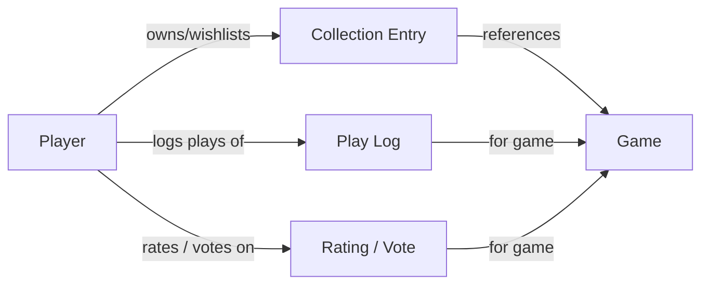

# Players & Collections

Games don't exist in a vacuum -- they're played by people. The specification models games, the people who *create* them ([People & Organizations](./people.md)), and the people who *play* them. The Player entity captures who is behind the votes, ratings, play logs, and collection data that power every community-sourced metric in the specification.

Without Player data, every voter is interchangeable. A first-time casual gamer's weight vote counts the same as a 20-year veteran's. A voter who uses a 1-5 scale is averaged with one who uses 6-10. A rating from someone who played once is indistinguishable from someone who played 50 times. The Player entity makes these differences visible and actionable.

## The Player Entity

| Field | Type | Required | Description |
|-------|------|----------|-------------|
| `id` | UUIDv7 | yes | Primary identifier |
| `slug` | string | yes | URL-safe username (e.g., `jane-gamer-42`) |
| `display_name` | string | yes | Public display name |
| `declared_rating_scale` | object | no | Voter's preferred rating scale (e.g., `{min: 1, max: 5}` or `{min: 1, max: 10}`) -- used for normalization (see [Rating Model](./rating-model.md)) |
| `experience_level` | enum | no | Self-assessed: `new_to_hobby`, `casual`, `experienced`, `hardcore` |
| `created_at` | datetime | yes | When this player joined |

The Player entity is deliberately minimal. Most of the richness comes from *relationships* -- what games they own, play, and rate -- not from fields on the entity itself.

## Collection

A player's collection captures their relationship to specific games:

| Field | Type | Required | Description |
|-------|------|----------|-------------|
| `player_id` | UUIDv7 | yes | The player |
| `game_id` | UUIDv7 | yes | The game |
| `status` | enum | yes | `owned`, `previously_owned`, `wishlist`, `want_in_trade`, `for_trade`, `preordered` |
| `added_at` | datetime | yes | When this status was set |
| `rating` | float (1-10) | no | This player's rating of this game (normalized to canonical scale) |
| `play_count` | integer | no | Total times this player has played this game |

A player can have multiple statuses for the same game over time (owned → for_trade → previously_owned). The collection is a time-series of the player's relationship with each game.

### Collection as Demand Signal

Aggregate collection data produces the demand signals that publishers use for print run planning:

| Aggregate Metric | Derived From | Use Case |
|-----------------|-------------|----------|
| `owner_count` | Count of `status: owned` | Install base -- how many copies are in the wild |
| `wishlist_count` | Count of `status: wishlist` | Forward demand -- how many people want this game |
| `for_trade_count` | Count of `status: for_trade` | Churn signal -- how many owners want to get rid of it |
| `previously_owned_count` | Count of `status: previously_owned` | Lifetime churn -- how many have come and gone |

These aggregates are surfaced on the [Game entity](./games.md) via [ADR-0041](../../adr/0041-community-signals-and-aggregate-statistics.md). The Player entity is where the underlying per-player data lives.

## Play Logs

Each play session is recorded as a structured log entry:

| Field | Type | Required | Description |
|-------|------|----------|-------------|
| `player_id` | UUIDv7 | yes | The player |
| `game_id` | UUIDv7 | yes | The game played |
| `date` | date | yes | When the session occurred |
| `duration_minutes` | integer | no | How long the session took |
| `player_count` | integer | no | How many people played |
| `experience_level` | enum | no | Player's experience with this game at the time of play: `first_play`, `learning`, `experienced`, `expert` |
| `included_teaching` | boolean | no | Whether rules teaching was part of this session |
| `expansion_ids` | UUID[] | no | Which expansions were used |

Play logs are the foundation of:
- **Community playtime data** -- aggregated into the [Play Time Model](./playtime.md)
- **Experience-bucketed playtime** -- [ADR-0034](../../adr/0034-experience-bucketed-playtime.md)
- **Player count ratings** -- "how many times have you played at this count?" comes from the player's logs
- **Engagement metrics** -- plays-per-owner ratio on the Game entity

## Taste Profile (Derived)

A player's taste profile is computed from their collection, ratings, and play history -- never self-declared. Self-declared preferences are unreliable ("I like all kinds of games" says the person whose collection is 90% heavy euros). Behavioral data is honest.

| Derived Attribute | Computed From | Description |
|------------------|-------------|-------------|
| `preferred_weight_range` | Median weight of owned + highly-rated games | Where this player lives on the complexity spectrum |
| `preferred_player_count` | Mode of player counts in play logs | What group size they typically play at |
| `preferred_mechanics` | Most frequent mechanics in owned + highly-rated games | What interaction styles they gravitate toward |
| `preferred_themes` | Most frequent themes in owned + highly-rated games | What settings/topics they enjoy |
| `collection_diversity` | Entropy of mechanics/themes/weight in collection | How broad or narrow their taste is |
| `play_frequency` | Plays per month over trailing 12 months | How actively they engage with the hobby |

These are **derived, not stored as fields on the entity**. Implementations compute them from the underlying data. The specification defines what they mean, not how to compute them -- different algorithms may produce slightly different profiles.

## Player Archetypes

Archetypes are clusters of players with similar behavioral profiles. They are **derived from data, not self-declared labels**. A player isn't "labeled" a eurogamer -- their collection, ratings, and play patterns cluster with other eurogamers.

Example archetypes (implementation-defined, not spec-mandated):

| Archetype | Behavioral Signals |
|-----------|-------------------|
| **Casual / Family** | Low play frequency, light-medium weight preference, high player count, party/family mechanics |
| **Eurogamer** | Medium-heavy weight, low luck tolerance, engine-building/worker-placement mechanics |
| **Thematic / Ameritrash** | Theme-driven collection, higher luck tolerance, narrative/adventure mechanics |
| **Wargamer** | Heavy weight, hex-and-counter or area-control mechanics, historical themes |
| **Solo gamer** | Predominantly 1-player logs, cooperative mechanics, puzzle-like games |
| **Collector** | Large collection relative to play count, high acquisition rate |
| **Social / Party** | Light weight, high player count, social deduction / word game mechanics |

Archetypes enable **corpus-based analysis**: "What do players who own 50+ cooperative games think of this game at 2 players?" This is fundamentally different from -- and more useful than -- "What does the BGG average say?"

## Why Players Matter for Data Quality

The Player entity directly addresses the data quality problems documented across the model docs:

| Problem | How Player Data Helps |
|---------|----------------------|
| **Inconsistent rating scales** ([Rating Model](./rating-model.md)) | `declared_rating_scale` on the Player provides the normalization key |
| **Uncalibrated weight votes** ([Weight Model](./weight-model.md)) | A player's experience level and play count for the game contextualizes their weight vote |
| **Self-selection bias** ([Data Provenance](./data-provenance.md)) | If we know the archetype distribution of voters for a game, we can quantify the bias |
| **Complexity bias in ratings** ([Rating Model](./rating-model.md)) | Ratings can be segmented by player archetype -- "what do casual gamers rate this?" vs "what do hardcore eurogamers rate this?" |
| **Pre-release brigading** ([Rating Model](./rating-model.md)) | Play count = 0 flags votes from people who haven't played the game |
| **Experience-dependent perception** ([Weight Model](./weight-model.md)) | The player's play count for a specific game contextualizes whether this is a first-impression or a veteran assessment |

## Corpus-Based Filtering

The Player entity enables a fundamentally new kind of filtering for [Pillar 2](../filtering/overview.md):

**Traditional filtering:** "Show me cooperative games, weight 2.5-3.5, best at 2 players" -- filters on game properties.

**Corpus-based filtering:** "Show me cooperative games rated above 4.0 by players whose collection is similar to mine" -- filters on game properties *as assessed by a specific player population*.

This is the difference between "what does the crowd think?" and "what do people like me think?" The Player entity makes the second question answerable.

### Example Queries

**"Games rated highly by players like me":**

```http
GET /games/search?mechanics=cooperative&weight_min=2.5&weight_max=3.5
    &corpus=similar_to_player:01912f4c-a1b2-7c3d-8e4f-5a6b7c8d9e0f
    &corpus_rating_min=4.0
```

```json
{
  "data": [
    {
      "slug": "pandemic",
      "name": "Pandemic",
      "weight": 2.42,
      "average_rating": 7.6,
      "corpus_rating": 8.9,
      "corpus_match": {
        "similar_players": 342,
        "corpus_rating_count": 287
      },
      "_links": {
        "self": { "href": "/games/pandemic" }
      }
    },
    {
      "slug": "the-crew-mission-deep-sea",
      "name": "The Crew: Mission Deep Sea",
      "weight": 2.07,
      "average_rating": 8.1,
      "corpus_rating": 8.7,
      "corpus_match": {
        "similar_players": 342,
        "corpus_rating_count": 198
      },
      "_links": {
        "self": { "href": "/games/the-crew-mission-deep-sea" }
      }
    }
    // ...
  ],
  "_links": {
    "self": { "href": "/games/search?mechanics=cooperative&weight_min=2.5&weight_max=3.5&corpus=similar_to_player:01912f4c-a1b2&corpus_rating_min=4.0" }
  }
}
```

Note `corpus_rating` (8.9) vs `average_rating` (7.6) for Pandemic -- players with similar collections rate it significantly higher than the general population. This is the corpus signal: the undifferentiated crowd rates it 7.6, but *people like you* rate it 8.9.

**"Top solo games according to solo gamers":**

```http
GET /games/search?corpus=archetype:solo-gamer&top_at=1&sort=corpus_rating
```

```json
{
  "data": [
    {
      "slug": "mage-knight",
      "name": "Mage Knight",
      "weight": 4.28,
      "average_rating": 8.1,
      "corpus_rating": 9.2,
      "corpus_match": {
        "archetype": "solo-gamer",
        "archetype_voters": 1847,
        "corpus_rating_count": 1203
      },
      "player_count_ratings": {
        "1": { "average_rating": 4.8, "rating_count": 1589 }
      },
      "_links": {
        "self": { "href": "/games/mage-knight" }
      }
    }
    // ...
  ]
}
```

The solo-gamer archetype rates *Mage Knight* at 9.2 vs the general population's 8.1 -- and the per-count rating at 1 player is 4.8/5. This is a game that the broader community likes, but solo gamers *love*.

These queries are aspirational -- the specification defines the data model that makes them possible, but the query syntax and implementation are future RFC topics.

## Privacy Considerations

Player data is sensitive. The specification defines these principles:

- **Opt-in.** Player profiles are created voluntarily. Anonymous voting remains possible -- a vote without a linked Player entity is valid but lacks the context metadata.
- **Aggregation without exposure.** Archetype distributions, corpus-based ratings, and voter population analysis can be computed without exposing individual player identities or collections.
- **Player controls their data.** A player can delete their profile, which anonymizes their votes (the votes remain, the Player link is severed).
- **No required disclosure.** Fields like `declared_rating_scale` and `experience_level` are optional. Players provide what they're comfortable with.

## Relationship to Other Entities



The Player is the hub connecting games to the community data about them. Every rating, weight vote, player count rating, playtime log, and collection status traces back to a Player -- or to an anonymous voter whose data is valid but uncontextualized.
