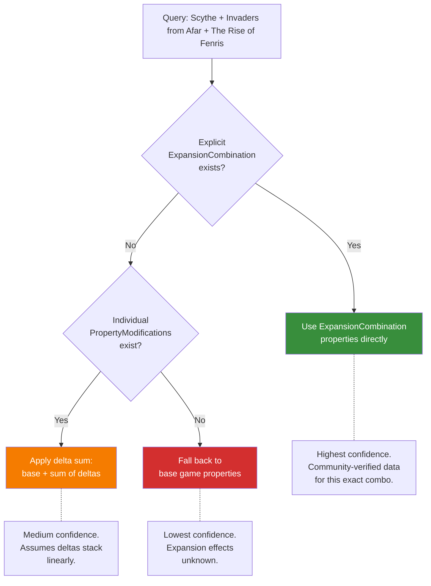

# Property Deltas & Combinations

Expansions do not just add content -- they change the *properties* of the base game. *Invaders from Afar* does not just add factions to *Scythe*; it raises the maximum player count from 5 to 7, extends play time at higher counts, and nudges the complexity weight upward with two new asymmetric factions. The property delta system captures these changes as structured, queryable data.

This is what makes [effective mode filtering](../filtering/effective-mode.md) possible. Without it, you could only filter games by their base properties. With it, you can ask "what games support 6 players when I include expansions?" and get answers.

## Three Layers of Data

### Layer 0: Edition Deltas

Before expansion deltas are considered, the system accounts for *edition differences*. The same game may exist in multiple printings or editions -- a revised edition might change the player count, adjust component counts that affect play time, or rebalance mechanics that shift the complexity weight. Edition deltas capture these differences relative to the **canonical edition** (the reference edition whose properties match the Game entity's top-level values).

Key properties of edition deltas:

- **Applied before expansion deltas** in the resolution pipeline. The edition provides the adjusted base that expansions then modify.
- **One edition at a time** -- unlike expansions, there is no combinatorial explosion. A game session uses exactly one edition.
- **Deltas are relative to the canonical edition.** If the 2017 first printing is canonical and the 2020 revised edition changes max play time from 120 to 90 minutes, the delta is -30 minutes.
- **Optional.** Many games have only one edition or no tracked edition differences. When no edition data exists, the canonical (top-level) properties are used directly.

The `is_canonical` flag on `GameEdition` marks which edition's properties match the Game entity's top-level values. The `EditionDelta` schema captures the property differences for non-canonical editions. See [ADR-0035](../../adr/0035-edition-level-property-deltas.md) for the full design rationale.

### Layer 1: PropertyModification (Individual Deltas)

A `PropertyModification` records how a *single expansion* changes a *single property* of its base game.

| Field | Type | Required | Description |
|-------|------|----------|-------------|
| `id` | UUIDv7 | yes | Primary identifier |
| `expansion_id` | UUIDv7 | yes | The expansion that causes this change |
| `base_game_id` | UUIDv7 | yes | The base game being modified |
| `property` | string | yes | Which property is changed (e.g., `max_players`, `weight`, `max_playtime`, `min_age`) |
| `modification_type` | enum | yes | How the property is changed: `set`, `add`, `multiply` |
| `value` | string | yes | The new value or delta (interpreted based on modification_type) |

**Modification types:**

- `set` -- Replace the property value entirely. "Max players becomes 6."
- `add` -- Add to the existing value. "Max playtime increases by 30 minutes."
- `multiply` -- Multiply the existing value. Used rarely, mainly for scaling factors.

### Layer 2: ExpansionCombination (Expansion Set-Level Effects)

An `ExpansionCombination` records the *effective properties* when a specific set of expansions is combined with a base game. This handles non-linear interactions: adding *Invaders from Afar* and *The Rise of Fenris* together does not simply stack their individual deltas. The combination has its own tested, community-verified properties.

| Field | Type | Required | Description |
|-------|------|----------|-------------|
| `id` | UUIDv7 | yes | Primary identifier |
| `base_game_id` | UUIDv7 | yes | The base game |
| `expansion_ids` | UUIDv7[] | yes | The set of expansions included (order irrelevant) |
| `min_players` | integer | no | Effective minimum player count |
| `max_players` | integer | no | Effective maximum player count |
| `min_playtime` | integer | no | Effective minimum play time |
| `max_playtime` | integer | no | Effective maximum play time |
| `weight` | float | no | Effective complexity weight |
| `best_at` | integer[] | no | Player counts where this combination is best |
| `recommended_at` | integer[] | no | Player counts where this combination is recommended |
| `min_age` | integer | no | Effective recommended minimum age |

## Three-Tier Resolution

When the system needs to determine the effective properties of a base game with a set of expansions, it follows a three-tier resolution strategy:

**Tier 1: Explicit combination.** If an `ExpansionCombination` record exists for exactly this set of expansions with this base game, use its properties. This is the most accurate: someone has verified "Scythe + IFA + Fenris supports 1-7 players at weight 3.52."

**Tier 2: Delta sum.** If no explicit combination exists but individual `PropertyModification` records exist for each expansion, sum the deltas. For `set` modifications, the last one wins (by expansion release date). For `add` modifications, sum the values. This is a reasonable approximation but may not capture non-linear interactions.

**Tier 3: Base fallback.** If no modification data exists at all, use the base game's properties unchanged. The expansion's effects are simply unknown.

The API response includes a `resolution_tier` field so consumers know the confidence level of the effective properties they received.

## *Scythe*: Full Worked Example

Here is the complete property delta data for *Scythe* and its expansions:

### Base Game Properties

| Property | Value |
|----------|-------|
| min_players | 1 |
| max_players | 5 |
| best_at | [4] |
| recommended_at | [3, 4, 5] |
| weight | 3.45 |
| min_playtime | 115 |
| max_playtime | 115 |
| min_age | 14 |

### Individual PropertyModifications

***Invaders from Afar* (2016):**

| Property | Type | Value | Effect |
|----------|------|-------|--------|
| max_players | set | 7 | Two new factions support up to 7 players |
| weight | set | 3.44 | BGG weight slightly lower than base 3.45 (see weight bias note below) |
| min_playtime | set | 90 | Minimum play time drops from 115 to 90 with more players |
| max_playtime | set | 140 | Play time extends at higher player counts |

***The Wind Gambit* (2017):**

| Property | Type | Value | Effect |
|----------|------|-------|--------|
| max_players | set | 7 | Airships support higher player counts |
| weight | set | 3.41 | Weight slightly *decreases* (airship module streamlines endgame) |
| min_playtime | set | 70 | Airship abilities can accelerate game end |
| max_playtime | set | 140 | Extended ceiling at higher player counts |

***The Rise of Fenris* (2018):**

| Property | Type | Value | Effect |
|----------|------|-------|--------|
| weight | set | 3.42 | BGG weight lower than base 3.45 (see weight bias note below) |
| min_playtime | set | 75 | Campaign episodes can be shorter than standard games |
| max_playtime | set | 150 | Full campaign episodes run longer |
| min_age | set | 12 | Age recommendation lowered from 14+ to 12+ |

*Fenris* does not change player count (still 1-5). It restructures the game into an 8-episode campaign and *lowers* the recommended age from 14+ to 12+ -- the campaign's guided structure makes the game more accessible to younger players. Its BGG weight (3.42) is slightly lower than the base game (3.45), following the same bias pattern as other expansions.

***Encounters* (2018):**

| Property | Type | Value | Effect |
|----------|------|-------|--------|
| max_players | set | 7 | Encounter cards work at expanded player counts |
| min_playtime | set | 90 | Minimum play time drops from 115 to 90 |

*Encounters* replaces combat events with a deck of narrative encounter cards. Its BGG weight of 2.71 reflects the encounter card content rated in isolation. Additional PropertyModifications may apply but are omitted here for brevity.

*Scythe* also has 14 promo packs that add factions, encounters, and modules. These are omitted from this worked example -- the four major expansions above are sufficient to demonstrate the property delta system.

> **Why are all expansion weights lower than the base game?** Every *Scythe* expansion has a *lower* BGG weight than the base game (3.45): *Invaders from Afar* is 3.44, *The Wind Gambit* is 3.41, *Fenris* is 3.42, and *Encounters* is 2.71. This does not mean expansions simplify the game. It reflects selection bias -- the people who rate expansion weights on BGG are experienced players who have already internalized the base game's complexity. They rate the *marginal* difficulty the expansion adds from their veteran perspective, not the total combined experience a new player would face. This is why explicit `ExpansionCombination` records are valuable: they capture the curated, community-verified complexity of the *combined* experience rather than relying on individually biased ratings that undercount total weight.

### ExpansionCombinations (Explicit)

***Scythe* + *Invaders from Afar*:**

| Property | Value |
|----------|-------|
| min_players | 1 |
| max_players | 7 |
| best_at | [4] |
| recommended_at | [3, 4, 5, 6] |
| weight | 3.44 |
| min_playtime | 90 |
| max_playtime | 140 |
| min_age | 14 |

***Scythe* + *The Wind Gambit*:**

| Property | Value |
|----------|-------|
| min_players | 1 |
| max_players | 7 |
| best_at | [4] |
| recommended_at | [3, 4, 5] |
| weight | 3.43 |
| min_playtime | 70 |
| max_playtime | 140 |
| min_age | 14 |

***Scythe* + *The Rise of Fenris*:**

| Property | Value |
|----------|-------|
| min_players | 1 |
| max_players | 5 |
| best_at | [3, 4] |
| recommended_at | [2, 3, 4, 5] |
| weight | 3.50 |
| min_playtime | 75 |
| max_playtime | 150 |
| min_age | 12 |

***Scythe* + *Invaders from Afar* + *The Wind Gambit*:**

| Property | Value |
|----------|-------|
| min_players | 1 |
| max_players | 7 |
| best_at | [4, 5] |
| recommended_at | [3, 4, 5, 6] |
| weight | 3.46 |
| min_playtime | 70 |
| max_playtime | 140 |

***Scythe* + *Invaders from Afar* + *The Rise of Fenris*:**

| Property | Value |
|----------|-------|
| min_players | 1 |
| max_players | 7 |
| best_at | [3, 4] |
| recommended_at | [2, 3, 4, 5, 6] |
| weight | 3.52 |
| min_playtime | 75 |
| max_playtime | 150 |

***Scythe* + *Invaders from Afar* + *The Wind Gambit* + *The Rise of Fenris*:**

| Property | Value |
|----------|-------|
| min_players | 1 |
| max_players | 7 |
| best_at | [3, 4, 5] |
| recommended_at | [2, 3, 4, 5, 6] |
| weight | 3.55 |
| min_playtime | 70 |
| max_playtime | 150 |

Notice how multi-expansion combinations produce different results than summing individual deltas. The `best_at` list with *Fenris* includes 3 players -- something no individual expansion achieves, because the campaign structure is particularly engaging at smaller counts. *The Wind Gambit's* reduced min_playtime of 70 minutes persists through combinations -- airship abilities that accelerate the endgame work regardless of other expansions present. And the weight with all major expansions reaches 3.55, above any individual expansion's weight, reflecting the cumulative cognitive load of managing factions, airships, and campaign modules simultaneously. These non-linear effects are why explicit `ExpansionCombination` records exist.

### Resolution in Action

If someone queries "*Scythe* + *Invaders from Afar* + *The Rise of Fenris*":

1. Check for an explicit `ExpansionCombination` with exactly `{IFA, Fenris}`. It exists with weight 3.52, 1-7 players, 75-150 min. **Tier 1.**

If instead someone queries "*Scythe* + *Invaders from Afar* + *The Rise of Fenris* + *Encounters*":

1. Check for an explicit `ExpansionCombination` with exactly `{IFA, Fenris, Encounters}`. None exists.
2. *Encounters* has `PropertyModification` records (`max_players: set 7`, `min_playtime: set 90`). Apply delta sum: max_players remains 7 (already set by IFA), min_playtime remains 75 (Fenris sets it lower than Encounters' 90). **Tier 2** -- the result is a reasonable approximation, but non-linear interactions between the three expansions are not captured.

## Data Quality

Property delta data is community-contributed and curated. The specification defines the schema; the data itself comes from:

- Publisher information (max player count with an expansion is often printed on the box)
- Community play reports (play time with expansions)
- Community voting (weight with expansions)
- Curator verification (explicit combination records reviewed by maintainers)

The `resolution_tier` field in API responses provides transparency about data quality, letting consumers decide how much to trust effective-mode results.
