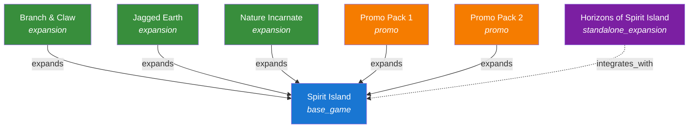
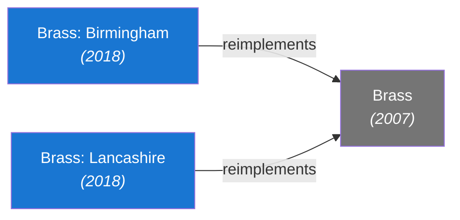

# Game Relationships

Games do not exist in isolation. An expansion extends a base game. A reimplementation shares mechanics with its predecessor. A big-box edition contains multiple products. The `GameRelationship` entity captures these connections as typed, directed edges.

## GameRelationship Entity

| Field | Type | Required | Description |
|-------|------|----------|-------------|
| `id` | UUIDv7 | yes | Primary identifier |
| `source_game_id` | UUIDv7 | yes | The game this relationship originates from |
| `target_game_id` | UUIDv7 | yes | The game this relationship points to |
| `relationship_type` | enum | yes | The type of relationship (see below) |
| `ordinal` | integer | no | Ordering hint for display (e.g., expansion release order) |

## Relationship Types

| Type | Direction | Description | Example |
|------|-----------|-------------|---------|
| `expands` | expansion -> base | Source adds content to target; source requires target to play | *Branch & Claw* expands *Spirit Island* |
| `reimplements` | new -> old | Source is a new version of target with mechanical changes | *Brass: Birmingham* reimplements *Brass* |
| `contains` | collection -> item | Source physically includes target (big-box, compilation) | *Dominion: Big Box* contains *Dominion* and *Dominion: Intrigue* |
| `requires` | dependent -> dependency | Source cannot be used without target (stronger than `expands`) | *Spirit Island: Feather & Flame Scenario Pack* requires *Branch & Claw* |
| `recommends` | game -> game | Source suggests target as a companion (non-binding) | A solo variant fan expansion recommends the base game's organizer insert |
| `integrates_with` | game <-> game | Source and target can be combined for a unified experience | *Star Realms* integrates_with *Star Realms: Colony Wars* |

### Directionality

All relationships are stored as directed edges from `source_game_id` to `target_game_id`. For symmetric relationships like `integrates_with`, both directions are stored:

- *Star Realms* -> integrates_with -> *Star Realms: Colony Wars*
- *Star Realms: Colony Wars* -> integrates_with -> *Star Realms*

This allows querying from either side without special-casing.

## The Spirit Island Family Tree

Spirit Island is an excellent example of the relationship model's expressiveness. It has standard expansions, a standalone expansion, and dependency chains:



Key observations from this graph:

- **Branch & Claw**, **Jagged Earth**, and **Nature Incarnate** are `expansion` type games with `expands` relationships pointing to Spirit Island. They require the base game.
- **Horizons of Spirit Island** is a `standalone_expansion`. It has an `integrates_with` relationship to Spirit Island (bidirectional) but does *not* have an `expands` relationship, because it does not require the base game.
- **Promo Packs** are `promo` type games with `expands` relationships. They add individual spirits or scenarios.

## Querying Relationships

### Get all expansions for a game

```http
GET /games/spirit-island/relationships?type=expands&direction=inbound
```

Returns all games where `target_game_id` is Spirit Island and `relationship_type` is `expands` — i.e., everything that expands Spirit Island.

### Get the full family tree

```http
GET /games/spirit-island/relationships?depth=2
```

Returns all relationships within 2 hops of Spirit Island, enabling reconstruction of the full family graph.

### Get what a game requires

```http
GET /games/branch-and-claw/relationships?type=expands&direction=outbound
```

Returns the single relationship: Branch & Claw expands Spirit Island.

## Reimplementation Example

Reimplementation captures when a game is rebuilt with significant changes but shares a lineage:



*Brass: Birmingham* and *Brass: Lancashire* both reimplement the original *Brass*. They are distinct games — different maps, different strategies — but share a mechanical lineage. The `reimplements` relationship captures this without implying compatibility or dependency.
