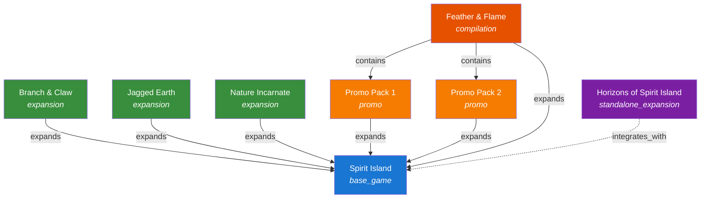
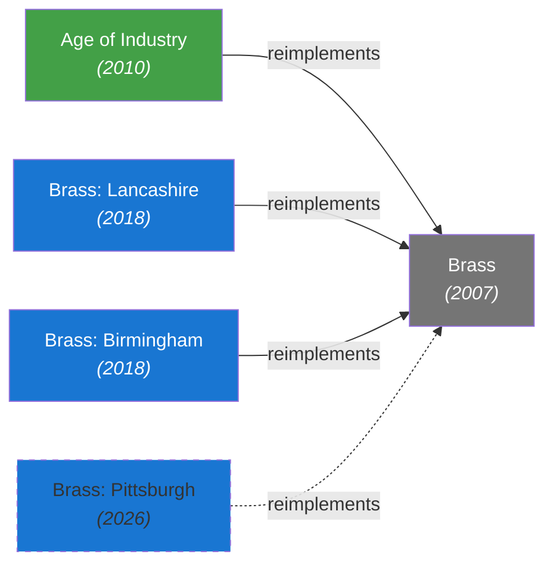

# Game Relationships

Games do not exist in isolation. An expansion extends a base game. A reimplementation shares mechanics with its predecessor. A big-box edition contains multiple products. The `GameRelationship` entity captures these connections as typed, directed edges.

## GameRelationship Entity

| Field | Type | Required | Description |
|-------|------|----------|-------------|
| `id` | UUIDv7 | yes | Primary identifier |
| `source_game_id` | UUIDv7 | yes | The game this relationship originates from |
| `target_game_id` | UUIDv7 | yes | The game this relationship points to |
| `relationship_type` | enum | yes | The type of relationship (see below) |
| `ordinal` | integer | no | Ordering hint for display (e.g., expansion release order) |

## Relationship Types

| Type | Direction | Description | Example |
|------|-----------|-------------|---------|
| `expands` | expansion -> base | Source adds content to target; source requires target to play | *Wingspan: European Expansion* expands *Wingspan* |
| `reimplements` | new -> old | Source is a new version of target with mechanical changes | *Brass: Birmingham* reimplements *Brass* |
| `contains` | collection -> item | Source physically includes target (big-box, compilation) | *Dominion: Big Box* contains *Dominion* and *Dominion: Intrigue* |
| `requires` | dependent -> dependency | Source cannot be used without target (stronger than `expands`) | *Spirit Island: Feather & Flame Scenario Pack* requires *Branch & Claw* |
| `recommends` | game -> game | Source suggests target as a companion (non-binding) | A solo variant fan expansion recommends the base game's organizer insert |
| `integrates_with` | game <-> game | Source and target can be combined for a unified experience | *Star Realms* integrates_with *Star Realms: Colony Wars* |

### Directionality

All relationships are stored as directed edges from `source_game_id` to `target_game_id`. For symmetric relationships like `integrates_with`, both directions are stored:

- *Star Realms* -> integrates_with -> *Star Realms: Colony Wars*
- *Star Realms: Colony Wars* -> integrates_with -> *Star Realms*

This allows querying from either side without special-casing.

## Case Study: The Spirit Island Family Tree

Spirit Island is an excellent example of the relationship model's expressiveness. It has standard expansions, a standalone expansion, and dependency chains:



Key observations from this graph:

- **Branch & Claw**, **Jagged Earth**, and **Nature Incarnate** are `expansion` type games with `expands` relationships pointing to Spirit Island. They require the base game.
- **Horizons of Spirit Island** is a `standalone_expansion`. It has an `integrates_with` relationship to Spirit Island (bidirectional) but does *not* have an `expands` relationship, because it does not require the base game.
- **Promo Packs** are `promo` type games with `expands` relationships. They add individual spirits or scenarios. **Feather & Flame** is a `compilation` that `contains` both Promo Pack 1 and Promo Pack 2 — the individual packs were difficult to obtain, so they were re-released as a single product. It also `expands` Spirit Island directly.

## Querying Relationships

### Get all expansions for a game

```http
GET /games/spirit-island/relationships?type=expands&direction=inbound
```

Returns all games where `target_game_id` is Spirit Island and `relationship_type` is `expands` — i.e., everything that expands Spirit Island.

```json
{
  "data": [
    {
      "source_game_id": "01912f4c-7e3a-7b1a-8c5d-9f0e1a2b3c4d",
      "target_game_id": "01912f4c-8a2b-7c3d-9e4f-0a1b2c3d4e5f",
      "relationship_type": "expands",
      "metadata": {
        "adds_spirits": 2,
        "adds_power_cards": 22
      },
      "_links": {
        "source": { "href": "/games/spirit-island", "title": "Spirit Island" },
        "target": { "href": "/games/spirit-island-branch-and-claw", "title": "Spirit Island: Branch & Claw" }
      }
    },
    {
      "source_game_id": "01912f4c-7e3a-7b1a-8c5d-9f0e1a2b3c4d",
      "target_game_id": "01912f4c-9b3c-7d4e-af5a-1b2c3d4e5f6a",
      "relationship_type": "expands",
      "metadata": {
        "adds_spirits": 10,
        "adds_power_cards": 52
      },
      "_links": {
        "source": { "href": "/games/spirit-island", "title": "Spirit Island" },
        "target": { "href": "/games/spirit-island-jagged-earth", "title": "Spirit Island: Jagged Earth" }
      }
    },
    // ... Nature Incarnate, Promo Pack 1, Promo Pack 2, Feather & Flame
  ],
  "_links": {
    "self": { "href": "/games/spirit-island/relationships?type=expands&direction=inbound" }
  }
}
```

### Get the full family tree

```http
GET /games/spirit-island/relationships?depth=2
```

Returns all relationships within 2 hops of Spirit Island, enabling reconstruction of the full family graph.

```json
{
  "data": [
    {
      "source_game_id": "01912f4c-7e3a-7b1a-8c5d-9f0e1a2b3c4d",
      "target_game_id": "01912f4c-8a2b-7c3d-9e4f-0a1b2c3d4e5f",
      "relationship_type": "expands",
      "_links": {
        "source": { "href": "/games/spirit-island", "title": "Spirit Island" },
        "target": { "href": "/games/spirit-island-branch-and-claw", "title": "Spirit Island: Branch & Claw" }
      }
    },
    // ... other expands relationships ...
    {
      "source_game_id": "01912f4c-7e3a-7b1a-8c5d-9f0e1a2b3c4d",
      "target_game_id": "01912f4c-bd5e-7f6a-cb7c-3d4e5f6a7b8c",
      "relationship_type": "integrates_with",
      "_links": {
        "source": { "href": "/games/spirit-island", "title": "Spirit Island" },
        "target": { "href": "/games/horizons-of-spirit-island", "title": "Horizons of Spirit Island" }
      }
    },
    {
      "source_game_id": "01912f4c-ea8b-7c9d-fe0f-6a7b8c9d0e1f",
      "target_game_id": "01912f4c-ce6f-7a7b-dc8d-4e5f6a7b8c9d",
      "relationship_type": "contains",
      "_links": {
        "source": { "href": "/games/spirit-island-feather-and-flame", "title": "Spirit Island: Feather & Flame" },
        "target": { "href": "/games/spirit-island-promo-pack-1", "title": "Spirit Island: Promo Pack 1" }
      }
    },
    // ... depth=2 traversal includes relationships of related games
  ],
  "_links": {
    "self": { "href": "/games/spirit-island/relationships?depth=2" }
  }
}
```

### Get what a game requires

```http
GET /games/spirit-island-branch-and-claw/relationships?type=expands&direction=outbound
```

Returns the single relationship: Branch & Claw expands Spirit Island.

```json
{
  "data": [
    {
      "source_game_id": "01912f4c-8a2b-7c3d-9e4f-0a1b2c3d4e5f",
      "target_game_id": "01912f4c-7e3a-7b1a-8c5d-9f0e1a2b3c4d",
      "relationship_type": "expands",
      "metadata": {
        "adds_spirits": 2,
        "adds_power_cards": 22
      },
      "_links": {
        "source": { "href": "/games/spirit-island-branch-and-claw", "title": "Spirit Island: Branch & Claw" },
        "target": { "href": "/games/spirit-island", "title": "Spirit Island" }
      }
    }
  ],
  "_links": {
    "self": { "href": "/games/spirit-island-branch-and-claw/relationships?type=expands&direction=outbound" }
  }
}
```

## Case Study: Brass Reimplementations

Reimplementation captures when a game is rebuilt with significant changes but shares a lineage. The Brass family spans nearly two decades:



Key observations from this graph:

- **Brass (2007)** — Martin Wallace's original design, set in Lancashire during the Industrial Revolution. All subsequent entries reimplement this game.
- **Age of Industry (2010)** — Wallace's own abstracted reimplementation with variable maps, predating the 2018 relaunch. A distinct design direction (green) from the later Roxley series.
- **Brass: Lancashire (2018)** — a refined re-release of the original *Brass* by Roxley Games. Same Lancashire setting, updated rules and art. Despite sharing a setting with the 2007 original, it is a distinct game entry with a `reimplements` relationship.
- **Brass: Birmingham (2018)** — a new map with distinct economic strategies, also by Roxley. Paired with Lancashire as the 2018 relaunch.
- **Brass: Pittsburgh (2026)** — upcoming entry in the Roxley series (dashed arrow indicates unreleased).

All five are distinct games linked by `reimplements`, capturing mechanical lineage without implying compatibility or dependency.

> **Why not treat these as versions of one game?** On BoardGameGeek, the original *Brass* (2007) has no separate entry — it exists only as a "Version" under *Brass: Lancashire*. This collapses a meaningful design distinction: the 2007 and 2018 games have different rules, different component sets, and different ratings communities. OpenTabletop models them as separate game entities connected by `reimplements`, preserving the historical lineage while keeping each game's data (ratings, polls, weight) independent.
