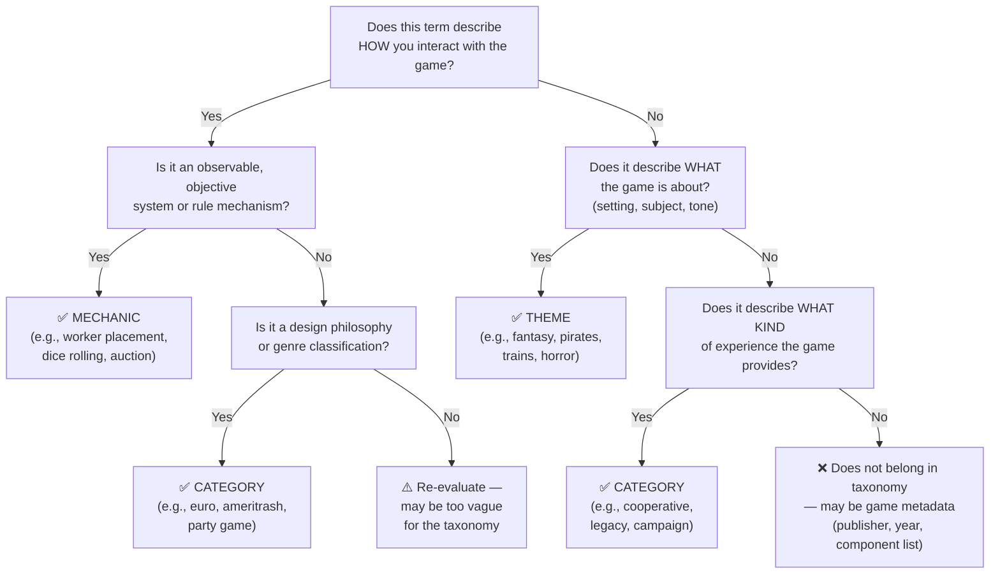

# Taxonomy Classification Criteria

This document provides the decision framework for classifying game attributes into the three OpenTabletop vocabulary types: **mechanics**, **categories**, and **themes**. Use this guide when proposing taxonomy additions via RFC, reviewing contributions, or importing data from external sources.

## The Three Vocabulary Types

| Type | Question it answers | Example |
|------|-------------------|---------|
| **Mechanic** | *How* do you interact with the game? | Worker placement, dice rolling, deck building |
| **Category** | *What kind* of experience is it? | Euro, party, cooperative, dungeon crawler |
| **Theme** | *What* is it about? | Fantasy, pirates, trains, horror |

## Decision Tree

Use this flowchart when classifying a proposed term:

## Worked Examples

### Clear cases

- **"Deck building"** — You physically build a deck during play. Observable system with specific rules. → **Mechanic.**
- **"Euro"** — Describes a cluster of design choices (low luck, indirect conflict, resource conversion). Not a single mechanism. → **Category.**
- **"Fantasy"** — Describes the setting. → **Theme.**
- **"Trains"** — What the game is about. → **Theme.**
- **"Party game"** — What kind of experience (large group, social, quick). → **Category.**

### Grey zone cases

- **"Cooperative"** — This is both a mechanic AND a category. The mechanic `cooperative` describes the *system* (shared win condition, game-as-opponent). The category `cooperative-game` describes the *experience type* (playing together). Both entries exist with distinct definitions and distinct slugs (`cooperative` vs `cooperative-game`).

- **"Legacy"** — Both a mechanic and a category. The mechanic `legacy` describes the *system* (permanent component modification). The category `legacy-game` describes the *format* (finite lifecycle, sealed content). Both entries exist.

- **"Horror"** — A theme, not a category. "Horror" describes what the game is about (dark, frightening setting), not what kind of experience it provides. A worker-placement game about haunted houses is still a euro with a horror theme, not a "horror game" in the categorical sense.

- **"Miniatures"** — A theme describing a component-centric hobby aspect, not a mechanic (miniatures don't change how you play) and not a category (miniatures games span all design philosophies).

## Grey Zone Rules

When a term sits at a boundary between vocabulary types:

1. **Both mechanic and category**: Acceptable when the mechanic describes a *system* and the category describes an *experience*. Use distinct slugs and definitions. The mechanic entry goes in `mechanics.yaml`; the category entry goes in `categories.yaml`. Cross-reference in definitions.

2. **Category vs. theme boundary**: Prefer **theme** unless the term describes a distinct design philosophy with defining mechanical characteristics. "Fantasy" is a theme (setting). "Euro" is a category (design philosophy). "Dungeon crawler" is a category (distinct gameplay loop with defining characteristics).

3. **Components are not mechanics**: "Cards," "dice," and "miniatures" are components. "Card drafting," "dice rolling," and "measurement movement" are mechanics — they describe how you *use* those components.

4. **Scale test**: A proposed term must apply to at least **10 published games** to warrant inclusion in the controlled vocabulary. Narrower terms belong in game-level metadata, not the taxonomy.

5. **Overlap test**: If a proposed term cannot be distinguished from an existing term in **one sentence**, it should be merged with the existing term (possibly as a synonym).

## Weight Scale Calibration

The OpenTabletop weight scale ranges from 1.0 to 5.0 and is anchored to reference games as comparative examples. Weight is a community perception of rules complexity and strategic depth — not an intrinsic property of the game and not a measure of game quality. The same game may be perceived as lighter by experienced players and heavier by newcomers. See [Data Provenance & Bias](./data-provenance.md) for a deeper discussion of why all community metrics are population-dependent.

| Weight | Label | Anchor Games | Characteristics |
|--------|-------|-------------|-----------------|
| 1.0 | Trivial | Candy Land, Chutes and Ladders | No meaningful decisions, pure randomness |
| 1.5 | Light | Uno, Sorry! | Minimal decisions, simple mechanics |
| 2.0 | Light-Medium | Ticket to Ride, Sushi Go! | Clear decisions, learnable in one session |
| 2.5 | Medium | Carcassonne, Pandemic | Meaningful strategy, multiple viable approaches |
| 3.0 | Medium-Heavy | Terraforming Mars, Wingspan | Significant decision space, interconnected systems |
| 3.5 | Heavy-Medium | Spirit Island, Brass: Birmingham | Complex interlocking systems, rewards experience |
| 4.0 | Heavy | Twilight Imperium, Agricola | Deep strategy, long rules explanation |
| 4.5 | Very Heavy | Mage Knight, War of the Ring | Extensive rules, many subsystems |
| 5.0 | Extreme | The Campaign for North Africa, ASL | Maximum complexity, simulation-level detail |

**Calibration rule**: When assigning weight, find the two anchor games that bracket the target game's perceived complexity. The weight should fall between those anchors. Cross-reference with BGG's community weight rating — significant divergence (>0.5) is worth investigating, as it may indicate a different voter population, a genuinely unusual game, or that the anchor comparison is misleading for this particular design.

## RFC Reviewer Checklist

When evaluating a proposed taxonomy addition:

- [ ] **Decision tree**: Does the term pass the mechanic/category/theme flowchart?
- [ ] **Scale test**: Does it apply to 10+ published games?
- [ ] **Overlap test**: Is it distinguishable from existing terms in one sentence?
- [ ] **Slug format**: Lowercase, hyphenated, max 50 characters?
- [ ] **Definition**: Precise enough to distinguish from related terms?
- [ ] **Examples**: At least 3 canonical examples provided?
- [ ] **BGG mapping**: BGG IDs provided if a mapping exists?
- [ ] **Cross-vocabulary check**: If it exists in another vocabulary type (mechanic vs. category), are both entries justified with distinct definitions?
