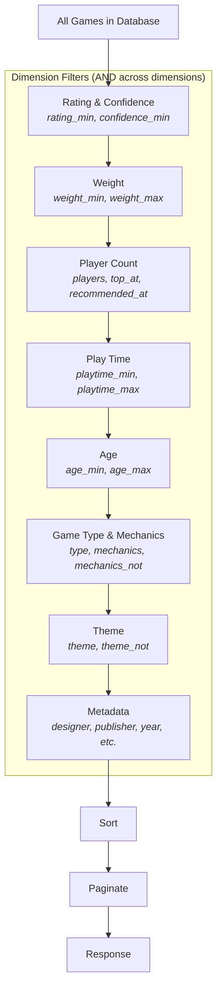

# Dimension Composition

Filter dimensions compose using a simple, predictable boolean model. The rules are:

- **Cross-dimension: AND.** All active dimensions must be satisfied. A game must match the player count filter AND the play time filter AND the weight filter AND every other active dimension.
- **Within dimension: OR.** Multiple values within a single dimension are combined with OR logic. `theme=["fantasy", "mythology"]` matches games with fantasy OR mythology.
- **Exclusion: NOT.** Parameters ending in `_not` exclude matches. `theme_not=["space"]` removes all space-themed games from the result set.

## The Filter Pipeline



The pipeline is conceptual -- the actual database query optimizes the execution order. But the logical behavior is as if each dimension filters the result set in sequence, with every game needing to pass all active filters.

## Within-Dimension OR

When a dimension accepts an array of values, those values are combined with OR:

```json
{
  "mechanics": ["cooperative", "solo"],
  "theme": ["fantasy", "nature"]
}
```

This matches games that have (cooperative OR solo mechanics) AND (fantasy OR nature theme). It does NOT require a game to have both cooperative and solo mechanics -- any one match within the dimension is sufficient.

## Within-Dimension AND

For mechanics specifically, the `mechanics_all` parameter switches to AND logic:

```json
{
  "mechanics_all": ["cooperative", "hand-management", "area-control"]
}
```

This matches only games that have ALL THREE mechanics. This is a much narrower filter.

## Combining OR and AND

`mechanics` (OR), `mechanics_all` (AND), and `mechanics_not` (NOT) can all be used together:

```json
{
  "mechanics": ["deck-building", "bag-building"],
  "mechanics_all": ["cooperative"],
  "mechanics_not": ["dice-rolling"]
}
```

This reads as: "Games that have (deck-building OR bag-building) AND have cooperative AND do NOT have dice-rolling."

In predicate logic:

```
(deck-building OR bag-building) AND cooperative AND NOT dice-rolling
```

## Cross-Dimension AND

Every active dimension must be satisfied:

```json
{
  "players": 4,
  "playtime_max": 90,
  "weight_min": 2.0,
  "weight_max": 3.5,
  "mechanics": ["cooperative"],
  "theme_not": ["space"]
}
```

A game appears in the results only if ALL of these are true:
1. It supports 4 players (player count dimension)
2. Its play time is at most 90 minutes (play time dimension)
3. Its weight is between 2.0 and 3.5 (weight dimension)
4. It has the cooperative mechanic (mechanics dimension)
5. It does NOT have the space theme (theme dimension)

If any single dimension fails, the game is excluded.

## Inactive Dimensions

A dimension that has no parameters set is inactive and matches everything. If you only specify `players=4`, then rating, weight, play time, age, mechanics, theme, and metadata are all unconstrained -- every game that supports 4 players is returned regardless of those other properties.

## Effective Mode Interaction

When `effective=true`, the player count, play time, and weight dimensions expand their search to include expansion combinations. This does not change the composition rules -- it changes the *data* that each dimension searches against. Instead of checking only the base game's properties, the filter also checks all known `ExpansionCombination` entries for that game.

See [Effective Mode](./effective-mode.md) for the full explanation.

## Edge Cases

**Empty array parameters.** An empty array (`"mechanics": []`) is treated as an inactive filter, not as "no mechanics." If you want games with literally no mechanics tagged, use a dedicated parameter (not yet specified; this is a future consideration).

**Conflicting constraints.** `weight_min=4.0&weight_max=2.0` is a valid query that returns zero results. The API does not reject logically impossible combinations -- it returns an empty result set.

**Null fields.** Games missing a field (e.g., no community play time data) are excluded from filters on that field unless a fallback is specified. A game with no `community_max_playtime` will not appear in `community_playtime_max=90` results, even if its publisher play time is under 90 minutes. The two data sources are independent.
