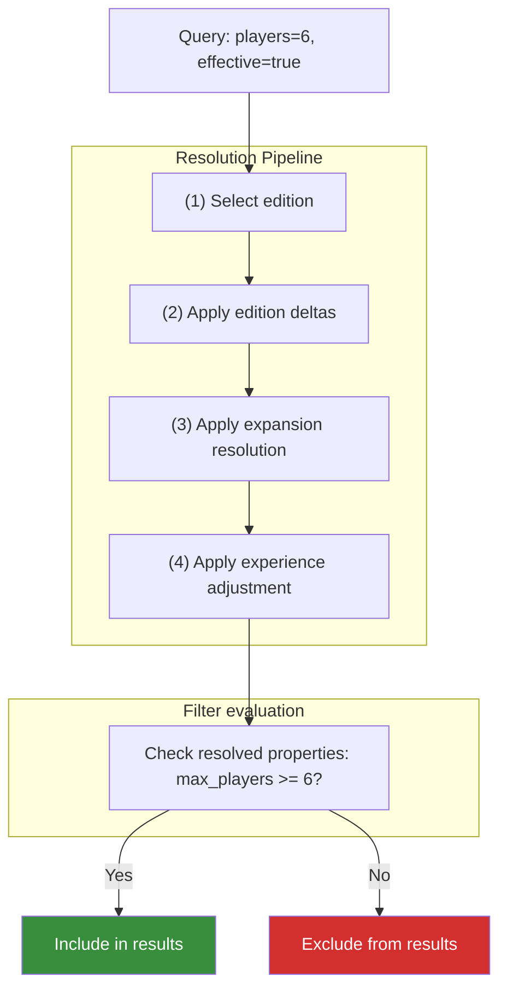

# Effective Mode

Effective mode is the feature that distinguishes OpenTabletop from every other board game API. When `effective=true`, the filtering system does not just search base game properties -- it searches across all known expansion combinations.

## The Problem Effective Mode Solves

*Spirit Island* supports 1-4 players in its base form. If you search for games that support 6 players, *Spirit Island* does not appear. But if you own *Spirit Island* and the *Jagged Earth* expansion, you *can* play with 6 people. The data exists -- *Jagged Earth* adds support for 5-6 players -- but no API exposes it as a searchable property.

Effective mode bridges this gap. With `effective=true`, the query:

```json
{
  "players": 6,
  "effective": true
}
```

will return *Spirit Island* because the system knows that the *Spirit Island* + *Jagged Earth* combination supports 6 players.

## How It Works

The effective properties resolution pipeline has four stages, applied in order:



For each game in the database, effective mode:

1. **Selects the edition.** If the query specifies an `edition` parameter, that edition's deltas are used. Otherwise the canonical edition (marked with `is_canonical=true`) is used. If no edition data exists, this step is a no-op.
2. **Applies edition deltas** to produce the edition-adjusted base properties. Edition deltas are relative to the canonical edition and modify player count, play time, weight, etc. See [ADR-0035](../../adr/0035-edition-level-property-deltas.md).
3. **Applies expansion resolution** using the edition-adjusted base as the starting point. This follows the [three-tier resolution](../data-model/property-deltas.md): explicit `ExpansionCombination` records, summed individual deltas, or base fallback.
4. **Applies experience adjustment** (ADR-0034) if the query includes an `experience` parameter, scaling playtime values by experience-level multipliers.
5. **Compares the resolved properties against filter values.** If any combination of edition + expansions satisfies the filter, the game is included.

## What Gets Searched

Effective mode applies to four filter dimensions:

| Dimension | Base fields | Effective fields |
|-----------|-------------|-----------------|
| Weight | `weight` | ExpansionCombination weight field |
| Player Count | `min_players`, `max_players`, `top_at`, `recommended_at` | ExpansionCombination player fields |
| Play Time | `min_playtime`, `max_playtime`, `community_min_playtime`, `community_max_playtime` | ExpansionCombination time fields |
| Age | `min_age` | ExpansionCombination min_age field |

Other dimensions (rating, mechanics, theme, metadata) are not affected by effective mode -- they operate on the base game's properties regardless.

### Integration modifier

| Parameter | Type | Default | Description |
|-----------|------|---------|-------------|
| `include_integrations` | boolean | `false` | When `true` (and `effective=true`), also searches combinations that involve `integrates_with` products. |

By default, effective mode only considers expansions linked via `expands` relationships. Products linked via `integrates_with` -- such as standalone introductory versions whose components are physically compatible with the full game -- are excluded unless the consumer opts in with `include_integrations=true`. See the [*Spirit Island* example](#spirit-island-example) for why this distinction matters.

## *Spirit Island* Example

Suppose the database contains these expansion combinations for *Spirit Island*:

| Combination | Players | Best At | Weight | Play Time |
|-------------|---------|---------|--------|-----------|
| Base only | 1-4 | 2 | 4.08 | 90-120 |
| + *Branch & Claw* | 1-4 | 2 | 4.24 | 90-150 |
| + *Jagged Earth* | 1-6 | 2-3 | 4.52 | 90-120 |
| + *Nature Incarnate* | 1-6 | 2-3 | 4.46 | 90-180 |
| + B&C + JE | 1-6 | 2-4 | 4.56 | 90-150 |
| + B&C + NI | 1-6 | 2-3 | 4.52 | 90-180 |
| + JE + NI | 1-6 | 2-4 | 4.60 | 90-180 |
| + B&C + JE + NI | 1-6 | 2-4 | 4.65 | 120-180 |
| + *Feather & Flame* | 1-4 | 2 | 4.55 | 90-120 |
| + *Horizons* *(integration)* | 1-4 | 2 | 3.82 | 60-120 |
| + *Horizons* + B&C *(integration)* | 1-4 | 2 | 3.98 | 60-150 |
| + *Horizons* + JE *(integration)* | 1-6 | 2-3 | 4.10 | 60-120 |

Rows marked *(integration)* only appear when `include_integrations=true`.

*Spirit Island* also has ***Horizons of Spirit Island***, a standalone introductory version (1-3 players, weight 3.56, 60-90 min). As a `standalone_expansion`, *Horizons* has its own base properties and appears independently in non-effective searches. Its components -- including five introductory spirits -- are compatible with the full game via the `integrates_with` relationship, so *Horizons* spirits can be shuffled into a base *Spirit Island* game. These cross-product combinations are valid but opt-in: they only appear in effective mode results when `include_integrations=true`.

The rationale for making integrations opt-in: `expands` products are designed as add-ons to a specific base game, so their combinations are predictable and expected. `integrates_with` products are separate games whose components *happen* to be compatible -- combining them may fundamentally change the experience in ways a casual searcher would not expect. A consumer who owns both products and wants to see all possibilities can opt in; a consumer browsing for games to buy sees only the standard expansion landscape.

***Feather & Flame*** is a compilation that bundles both of *Spirit Island*'s original Promo Packs (Promo Pack 1 and Promo Pack 2) into a single product. It adds new spirits -- including Finder of Paths Unseen, one of the most challenging spirits in the game -- along with adversaries, fear cards, scenarios, and aspect cards. While *Feather & Flame* does not change player count or play time, the added complexity is reflected in its weight (4.55 vs the base game's 4.08). This means *Feather & Flame* *can* be the reason *Spirit Island* matches a weight filter it would not otherwise match.

Now consider these queries:

**Query: `players=6`** (effective=false)
*Spirit Island* is excluded. Base game max is 4.

**Query: `players=6&effective=true`**
*Spirit Island* is included. The "*Jagged Earth*", "*Nature Incarnate*", and all multi-expansion combinations that include either support 6 players.

**Query: `top_at=4&effective=true`**
*Spirit Island* is included. The "B&C + JE", "JE + NI", and "B&C + JE + NI" combinations have 4 in their `top_at` lists.

**Query: `weight_min=4.4&weight_max=4.6&effective=true`**
*Spirit Island* is included. Multiple combinations fall in this range: "*Nature Incarnate*" (4.46), "*Jagged Earth*" (4.52), "B&C + NI" (4.52), "*Feather & Flame*" (4.55), "B&C + JE" (4.56), "JE + NI" (4.60). The system returns the first matching combination.

**Query: `weight_min=4.55&weight_max=4.65&effective=true`**
*Spirit Island* is included via "*Feather & Flame*" (4.55), "B&C + JE" (4.56), "JE + NI" (4.60), and "B&C + JE + NI" (4.65). Without effective mode, *Spirit Island* (weight 4.08) would be excluded.

**Query: `playtime_max=120&effective=true`**
*Spirit Island* is included via the base game (max 120), the *Jagged Earth* combination (max 120), and the *Feather & Flame* combination (max 120). The *Nature Incarnate* combinations with max 180 would not be the matching path. The system finds the combination that satisfies the constraint.

**Query: `weight_max=4.0&effective=true`**
*Spirit Island* is excluded. No standard expansion combination has weight <= 4.0 (the base game is 4.08). The *Horizons* integration combinations (3.82, 3.98) would match, but they are not searched because `include_integrations` defaults to `false`.

**Query: `weight_max=4.0&effective=true&include_integrations=true`**
*Spirit Island* is included via the "+ *Horizons*" integration combination (weight 3.82). This represents a game of *Spirit Island* using *Horizons* spirits, which lowers the overall complexity. The `matched_via` response includes `"integration": true` so the consumer knows the match involves a cross-product combination.

## Response Format

When effective mode produces a match through an expansion combination (not the base game), the response includes metadata about which combination matched:

```json
{
  "id": "01967b3c-5a00-7000-8000-000000000001",
  "slug": "spirit-island",
  "name": "Spirit Island",
  "matched_via": {
    "type": "expansion_combination",
    "combination_id": "01967b3c-6000-7000-8000-000000000055",
    "expansions": [
      { "slug": "spirit-island-branch-and-claw", "name": "Branch & Claw" },
      { "slug": "spirit-island-jagged-earth", "name": "Jagged Earth" },
      { "slug": "spirit-island-nature-incarnate", "name": "Nature Incarnate" }
    ],
    "effective_properties": {
      "min_players": 1,
      "max_players": 6,
      "top_at": [2, 3, 4],
      "weight": 4.65,
      "min_playtime": 120,
      "max_playtime": 180,
      "min_age": 14
    },
    "resolution_tier": 1
  }
}
```

The `matched_via` object tells the consumer exactly how the game satisfied the filter:
- `type`: `"base"` if the base game matched, `"expansion_combination"` if a combination matched, `"delta_sum"` if individual deltas were summed.
- `expansions`: Which expansions are in the matching combination.
- `effective_properties`: The actual property values used for matching.
- `resolution_tier`: 1 (explicit combination), 2 (delta sum), or 3 (base fallback).

## Performance Considerations

Effective mode is more expensive than standard filtering because the database must check multiple rows per game (one for each known expansion combination). The specification does not mandate a specific implementation strategy, but reference implementation notes:

- Expansion combinations are pre-computed and indexed. The query adds a JOIN, not a recursive computation.
- Games without any expansion data are checked only against their base properties (no overhead).
- The `type` filter defaults to `["base_game", "standalone_expansion"]`, which already excludes individual expansion entities from results. Effective mode searches *through* expansions but returns base games.

For most queries, effective mode adds modest overhead. For very broad queries (no other filters, large result sets), it may be noticeably slower. Consumers should use effective mode intentionally when expansion-aware results are needed, not as a default for every query.
