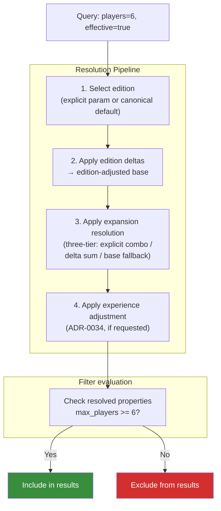

# Effective Mode

Effective mode is the feature that distinguishes OpenTabletop from every other board game API. When `effective=true`, the filtering system does not just search base game properties — it searches across all known expansion combinations.

## The Problem Effective Mode Solves

Spirit Island supports 1-4 players in its base form. If you search for games that support 6 players, Spirit Island does not appear. But if you own Spirit Island and the Jagged Earth expansion, you *can* play with 6 people. The data exists — Jagged Earth adds support for 5-6 players — but no API exposes it as a searchable property.

Effective mode bridges this gap. With `effective=true`, the query:

```json
{
  "players": 6,
  "effective": true
}
```

will return Spirit Island because the system knows that the Spirit Island + Jagged Earth combination supports 6 players.

## How It Works

The effective properties resolution pipeline has four stages, applied in order:



For each game in the database, effective mode:

1. **Selects the edition.** If the query specifies an `edition` parameter, that edition's deltas are used. Otherwise the canonical edition (marked with `is_canonical=true`) is used. If no edition data exists, this step is a no-op.
2. **Applies edition deltas** to produce the edition-adjusted base properties. Edition deltas are relative to the canonical edition and modify player count, play time, weight, etc. See [ADR-0035](../../adr/0035-edition-level-property-deltas.md).
3. **Applies expansion resolution** using the edition-adjusted base as the starting point. This follows the [three-tier resolution](../data-model/property-deltas.md): explicit `ExpansionCombination` records, summed individual deltas, or base fallback.
4. **Applies experience adjustment** (ADR-0034) if the query includes an `experience` parameter, scaling playtime values by experience-level multipliers.
5. **Compares the resolved properties against filter values.** If any combination of edition + expansions satisfies the filter, the game is included.

## What Gets Searched

Effective mode applies to three filter dimensions:

| Dimension | Base fields | Effective fields |
|-----------|-------------|-----------------|
| Player Count | `min_players`, `max_players`, `best_at`, `recommended_at` | ExpansionCombination player fields |
| Play Time | `min_playtime`, `max_playtime`, `community_min_playtime`, `community_max_playtime` | ExpansionCombination time fields |
| Weight | `weight` | ExpansionCombination weight field |

Other dimensions (mechanics, theme, metadata) are not affected by effective mode — they operate on the base game's properties regardless.

## Spirit Island Example

Suppose the database contains these expansion combinations for Spirit Island:

| Combination | Players | Best At | Weight | Play Time |
|-------------|---------|---------|--------|-----------|
| Base only | 1-4 | 2 | 3.89 | 90-120 |
| + Branch & Claw | 1-4 | 2 | 4.05 | 90-150 |
| + Jagged Earth | 1-6 | 2-3 | 4.10 | 90-150 |
| + B&C + JE | 1-6 | 2-4 | 4.20 | 120-180 |

Now consider these queries:

**Query: `players=6`** (effective=false)
Spirit Island is excluded. Base game max is 4.

**Query: `players=6&effective=true`**
Spirit Island is included. The "Jagged Earth" and "B&C + JE" combinations both support 6.

**Query: `best_at=4&effective=true`**
Spirit Island is included. The "B&C + JE" combination has 4 in its `best_at` list.

**Query: `weight_max=4.0&effective=true`**
Spirit Island is included via the base game (3.89) and the "B&C" combination (4.05 is > 4.0 so that one does not match, but the base does). Without effective mode, same result. But if the query were `weight_min=4.1&weight_max=4.3&effective=true`, the "B&C + JE" combination (4.20) would be the matching entry.

**Query: `playtime_max=120&effective=true`**
Spirit Island is included via the base game (max 120). But the "B&C + JE" combination (max 180) would not be the matching path. The system finds the combination that satisfies the constraint.

## Response Format

When effective mode produces a match through an expansion combination (not the base game), the response includes metadata about which combination matched:

```json
{
  "id": "01967b3c-5a00-7000-8000-000000000001",
  "slug": "spirit-island",
  "name": "Spirit Island",
  "matched_via": {
    "type": "expansion_combination",
    "combination_id": "01967b3c-6000-7000-8000-000000000042",
    "expansions": [
      { "slug": "branch-and-claw", "name": "Branch & Claw" },
      { "slug": "jagged-earth", "name": "Jagged Earth" }
    ],
    "effective_properties": {
      "min_players": 1,
      "max_players": 6,
      "best_at": [2, 3, 4],
      "weight": 4.20,
      "min_playtime": 120,
      "max_playtime": 180
    },
    "resolution_tier": 1
  }
}
```

The `matched_via` object tells the consumer exactly how the game satisfied the filter:
- `type`: `"base"` if the base game matched, `"expansion_combination"` if a combination matched, `"delta_sum"` if individual deltas were summed.
- `expansions`: Which expansions are in the matching combination.
- `effective_properties`: The actual property values used for matching.
- `resolution_tier`: 1 (explicit combination), 2 (delta sum), or 3 (base fallback).

## Performance Considerations

Effective mode is more expensive than standard filtering because the database must check multiple rows per game (one for each known expansion combination). The specification does not mandate a specific implementation strategy, but reference implementation notes:

- Expansion combinations are pre-computed and indexed. The query adds a JOIN, not a recursive computation.
- Games without any expansion data are checked only against their base properties (no overhead).
- The `type` filter defaults to `["base_game", "standalone_expansion"]`, which already excludes individual expansion entities from results. Effective mode searches *through* expansions but returns base games.

For most queries, effective mode adds modest overhead. For very broad queries (no other filters, large result sets), it may be noticeably slower. Consumers should use effective mode intentionally when expansion-aware results are needed, not as a default for every query.
