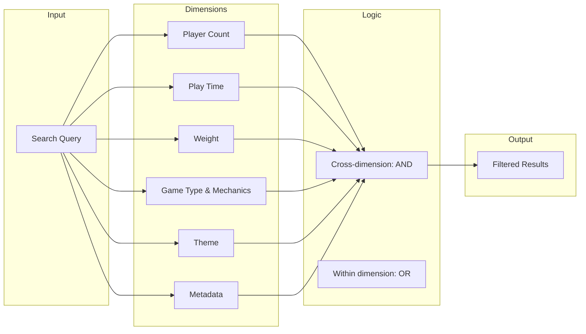

# Pillar 2: Filtering & Windowing

Filtering is the showcase feature of OpenTabletop. The data model defines *what the data looks like*; filtering defines *how you ask questions of it*. And the questions people actually want to ask — the ones they cannot answer today — are multi-dimensional.

## The Problem

It is game night. You have 4 people, about 90 minutes, and your group prefers medium-weight cooperative games. One person does not like space themes. You want suggestions.

Today, there is no way to answer this question with a single query to any existing board game service:

- **BGG** has no API filtering at all. You can search by name or browse ranked lists. There is no parameter for player count, play time, weight, mechanics, or theme. You must eyeball results manually.
- **BGG's advanced search** (on the website, not the API) supports some filters, but they cannot be combined effectively. You cannot filter by "best at 4" vs "supports 4." You cannot exclude themes. You cannot use community play times.
- **Board Game Atlas** had limited filtering before it shut down. It supported player count and play time but not weight, not mechanics combinations, and not expansion-aware effective mode.

The result is that every board game recommendation app, collection manager, and "what should we play" tool either builds its own filtering on top of scraped data or punts the problem to the user with a spreadsheet.

## What OpenTabletop Does Differently

OpenTabletop defines six orthogonal **filter dimensions** that compose using boolean logic:



Each dimension can contain multiple criteria (combined with OR logic within the dimension), and all active dimensions are combined with AND logic across dimensions. See [Dimension Composition](./composition.md) for the full boolean model.

### The Key Differentiators

1. **Community-aware player count.** Filter by "supports 4" OR "best at 4" OR "recommended at 4." These are three different questions with three different answer sets. See [Filter Dimensions](./dimensions.md).

2. **Dual play time sources.** Filter by publisher-stated time or community-reported time. When your group consistently takes longer than the box says, use community times. See [Play Time Model](../data-model/playtime.md).

3. **Expansion-aware effective mode.** The `effective=true` flag searches across expansion combinations. A game that only supports 4 players in its base form but supports 6 with an expansion will appear in a `players=6&effective=true` search. No other API can do this. See [Effective Mode](./effective-mode.md).

4. **Theme exclusion.** Not just "include cooperative games" but "exclude space-themed games." Negative filters are first-class. See [Filter Dimensions](./dimensions.md).

5. **Mechanic composition.** Find games that have ALL of a set of mechanics (`mechanics_all=["cooperative", "hand-management"]`) or ANY of a set (`mechanics=["cooperative", "hand-management"]`). See [Filter Dimensions](./dimensions.md).

6. **Single endpoint, JSON body.** Complex queries use `POST /games/search` with a JSON body instead of URL parameter soup. See [Search Endpoint](./search-endpoint.md).

## The Game Night Query

The scenario from the introduction, as an actual API call:

```http
POST /games/search HTTP/1.1
Content-Type: application/json

{
  "players": 4,
  "playtime_max": 90,
  "playtime_source": "community",
  "weight_min": 2.0,
  "weight_max": 3.5,
  "mechanics": ["cooperative"],
  "theme_not": ["space"],
  "sort": "rating_desc",
  "limit": 20
}
```

This query asks: "Find games that support exactly 4 players, with community-reported play time under 90 minutes, at medium weight (2.0-3.5), using cooperative mechanics, excluding space-themed games, sorted by rating, top 20 results."

Every parameter maps to a specific filter dimension. Every dimension is documented with its full parameter reference in [Filter Dimensions](./dimensions.md). The way they combine is documented in [Dimension Composition](./composition.md). Real-world scenarios with full request/response examples are in [Real-World Examples](./examples.md).
