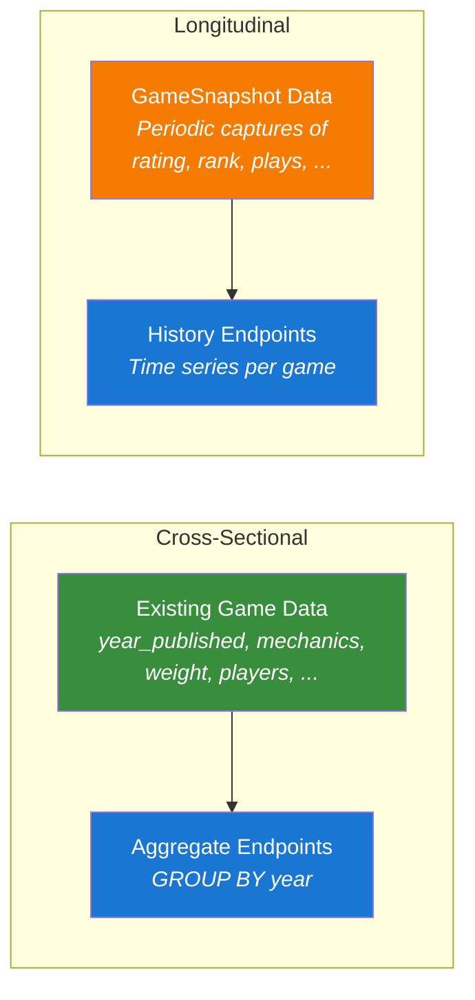

# Trend Analysis

The board game hobby is a living ecosystem. Mechanics rise and fall in popularity. Rating consensus shifts as communities mature. Publishing channels transform — Kickstarter barely existed for board games before 2012; by 2020 it was the dominant funding model for mid-tier publishers. The OpenTabletop specification provides the schema and endpoints to make these dynamics queryable.

## Two Types of Trends

Trend analysis splits into two fundamentally different problems, each requiring different data and different endpoints.

### Cross-Sectional Trends

Cross-sectional trends aggregate existing game data over `year_published`. They answer questions about the *population of games* at each point in time:

- "How many cooperative games were published per year?"
- "What's the average weight of games published each decade?"
- "What percentage of 2024 games support solo play?"
- "When did deck-building peak as a mechanic?"

These require **no new data collection**. Every game already has a `year_published`, `mechanics`, `weight`, `min_players`, and other filterable fields. Cross-sectional trends are pure aggregation — grouping and counting over existing records.

Note that cross-sectional trends reflect what is in the dataset, not necessarily all games published in a given year. If an implementation's data skews toward popular or well-known games, the trends will reflect that subset. Similarly, metrics like "average weight published per year" depend on who is rating those games — see [Data Provenance & Bias](../data-model/data-provenance.md).

### Longitudinal Trends

Longitudinal trends track the *same entities* over time. They answer questions about how individual games or rankings change, as perceived by the measuring population:

- "What was BGG #1 in 2019?"
- "How did Gloomhaven's rating change from 2018 to 2024?"
- "When did Brass: Birmingham overtake Terraforming Mars?"
- "Do legacy games' ratings decline after the campaign ends?"

These require **periodic snapshots** — point-in-time captures of each game's rating, weight, rank, and activity metrics. This is new data that does not exist in the current model. The `GameSnapshot` schema (see ADR-0036) defines the snapshot format; implementations choose the snapshot frequency (monthly, quarterly, or yearly) based on their resources.



## Cross-Sectional Endpoints

These endpoints aggregate over existing game data. All accept the standard filter dimensions (mechanic, category, theme, player count, weight range) so you can ask "how did cooperative games' average weight change over time?" — not just "how did all games' average weight change?"

### Publication Trends

```http
GET /statistics/trends/publications?group_by=year&mechanic=cooperative&year_min=2000
```

```json
{
  "data": [
    { "period": 2000, "game_count": 12, "avg_weight": 2.9, "avg_rating": 6.8 },
    { "period": 2008, "game_count": 34, "avg_weight": 2.7, "avg_rating": 7.2 },
    { "period": 2017, "game_count": 187, "avg_weight": 2.6, "avg_rating": 7.0 },
    { "period": 2024, "game_count": 342, "avg_weight": 2.8, "avg_rating": 7.1 }
  ]
}
```

The 2008 inflection point is visible — Pandemic's release triggered an explosion of cooperative game design. By 2024, cooperative games are nearly 30x more common than in 2000.

### Mechanic Adoption

```http
GET /statistics/trends/mechanics?year_min=2000&limit=5
```

```json
{
  "data": [
    { "period": 2007, "mechanic": "deck-building", "game_count": 0, "pct_of_period": 0.0 },
    { "period": 2008, "mechanic": "deck-building", "game_count": 1, "pct_of_period": 0.1 },
    { "period": 2012, "mechanic": "deck-building", "game_count": 87, "pct_of_period": 4.2 },
    { "period": 2020, "mechanic": "deck-building", "game_count": 156, "pct_of_period": 3.8 }
  ]
}
```

Dominion launched in 2008 as a single game. By 2012, deck-building was 4.2% of all published games. These mechanic adoption curves map directly to the phylogenetic model — every mechanic's `origin_game` and `origin_year` in the taxonomy data marks the start of its adoption curve.

### Weight Distribution

```http
GET /statistics/trends/weight?group_by=year&scope=top100
```

```json
{
  "data": [
    { "period": 2010, "avg_weight": 3.4, "median_weight": 3.3, "weight_p25": 2.8, "weight_p75": 3.9 },
    { "period": 2020, "avg_weight": 3.1, "median_weight": 3.0, "weight_p25": 2.5, "weight_p75": 3.6 },
    { "period": 2025, "avg_weight": 3.2, "median_weight": 3.1, "weight_p25": 2.6, "weight_p75": 3.7 }
  ]
}
```

The `scope` parameter controls which games are included:
- `top100` — Current top 100 ranked games, grouped by publication year
- `published` — All games published in each year (the broadest view)
- `all` — All games in the dataset, regardless of rank or year

### Player Count Trends

```http
GET /statistics/trends/player-count?year_min=2015
```

```json
{
  "data": [
    { "period": 2015, "avg_min_players": 1.8, "avg_max_players": 4.1, "solo_support_pct": 22.4 },
    { "period": 2020, "avg_min_players": 1.4, "avg_max_players": 4.2, "solo_support_pct": 38.5 },
    { "period": 2025, "avg_min_players": 1.3, "avg_max_players": 4.3, "solo_support_pct": 45.2 }
  ]
}
```

Solo support nearly doubled from 2015 to 2025 — a clear industry-wide shift toward accommodating solo gamers.

## Longitudinal Endpoints

These endpoints query `GameSnapshot` data. They require implementations to collect periodic snapshots (see ADR-0036). Longitudinal trend quality improves over time as more snapshots accumulate.

### Game History

```http
GET /games/spirit-island/history?metric=rating&granularity=yearly
```

```json
{
  "game": { "id": "01912f4c-...", "slug": "spirit-island", "name": "Spirit Island" },
  "metric": "rating",
  "granularity": "yearly",
  "data": [
    { "date": "2018-01-01", "average_rating": 8.05, "rating_count": 8420 },
    { "date": "2019-01-01", "average_rating": 8.18, "rating_count": 14230 },
    { "date": "2020-01-01", "average_rating": 8.25, "rating_count": 21500 },
    { "date": "2024-01-01", "average_rating": 8.31, "rating_count": 27842 }
  ]
}
```

Spirit Island's rating has been steadily climbing — a sign of a game with strong staying power that the community values more over time, not less.

### Ranking History

```http
GET /statistics/rankings/history?scope=overall&top=10&date=2020-01-01
```

```json
{
  "scope": "overall",
  "date": "2020-01-01",
  "data": [
    { "rank": 1, "game_slug": "gloomhaven", "bayes_rating": 8.85 },
    { "rank": 2, "game_slug": "pandemic-legacy-season-1", "bayes_rating": 8.62 },
    { "rank": 3, "game_slug": "brass-birmingham", "bayes_rating": 8.59 }
  ]
}
```

### Ranking Transitions

```http
GET /statistics/rankings/transitions?scope=overall&top=10&year_min=2018&year_max=2025
```

Shows which games entered and exited the top N over a date range — the "comings and goings" of the rankings. This is the data behind narratives like "the era of legacy games" or "the heavy euro resurgence."

## Funding Source

To track the impact of crowdfunding on the hobby, the specification includes an optional `funding_source` field on the Game entity:

```yaml
funding_source:
  enum: [retail, kickstarter, gamefound, backerkit, self_published, other]
```

This enables queries like:

```http
GET /statistics/trends/publications?group_by=year&funding_source=kickstarter&year_min=2012
```

"What percentage of published games each year were Kickstarter-funded?" — a question that tells the story of crowdfunding's disruption of traditional board game publishing.

## Connecting Trends to Taxonomy

The cross-sectional trend endpoints connect naturally to the taxonomy's phylogenetic model. Every mechanic in the controlled vocabulary has an `origin_game` and `origin_year` — the game that created or codified that mechanic. These speciation events are the inflection points visible in trend data:

| Year | Origin Game | Mechanic Created | Trend Impact |
|------|------------|-----------------|--------------|
| 2005 | Caylus | Worker Placement | Euro game renaissance |
| 2008 | Dominion | Deck Building | New mechanic family spawned |
| 2008 | Pandemic | Cooperative (modern) | Cooperative game explosion |
| 2011 | Risk Legacy | Legacy | Entirely new game category |
| 2018 | Welcome To... | Roll-and-Write (modern) | Accessible game surge |

The taxonomy data provides the *what* (which game created which mechanic); the trend endpoints provide the *so what* (how did the hobby change as a result).

## Design Decisions

See [ADR-0036](../../adr/0036-time-series-snapshots-and-trend-analysis.md) for the full design rationale, including why periodic snapshots were chosen over event sourcing, and the trade-offs between snapshot granularity options.
