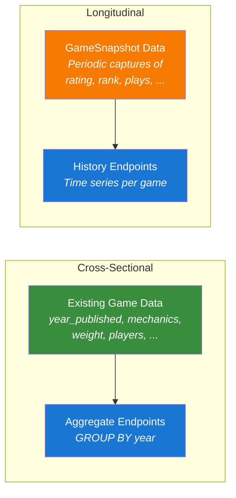

# Trend Analysis

The board game hobby is a living ecosystem. Mechanics rise and fall in popularity. Rating consensus shifts as communities mature. Publishing channels transform -- Kickstarter barely existed for board games before 2012; by 2020 it was the dominant funding model for mid-tier publishers. The OpenTabletop specification provides the schema and endpoints to make these dynamics queryable.

## Two Types of Trends

Trend analysis splits into two fundamentally different problems, each requiring different data and different endpoints.

### Cross-Sectional Trends

Cross-sectional trends aggregate existing game data over `year_published`. They answer questions about the *population of games* at each point in time:

- "How many cooperative games were published per year?"
- "What's the average weight of games published each decade?"
- "What percentage of 2024 games support solo play?"
- "When did deck-building peak as a mechanic?"

These require **no new data collection**. Every game already has a `year_published`, `mechanics`, `weight`, `min_players`, and other filterable fields. Cross-sectional trends are pure aggregation -- grouping and counting over existing records.

Note that cross-sectional trends reflect what is in the dataset, not necessarily all games published in a given year. If an implementation's data skews toward popular or well-known games, the trends will reflect that subset. Similarly, metrics like "average weight published per year" depend on who is rating those games -- see [Data Provenance & Bias](../data-model/data-provenance.md).

### Longitudinal Trends

Longitudinal trends track the *same entities* over time. They answer questions about how individual games or rankings change, as perceived by the measuring population:

- "What was BGG #1 in 2019?"
- "How did *Gloomhaven*'s rating change from 2018 to 2024?"
- "When did *Brass: Birmingham* overtake *Terraforming Mars*?"
- "Do legacy games' ratings decline after the campaign ends?"

These require **periodic snapshots** -- point-in-time captures of each game's rating, weight, rank, and activity metrics. This is new data that does not exist in the current model. The `GameSnapshot` schema (see [ADR-0036](../../adr/0036-time-series-snapshots-and-trend-analysis.md)) defines the snapshot format; implementations choose the snapshot frequency (monthly, quarterly, or yearly) based on their resources.



## Cross-Sectional Endpoints

These endpoints aggregate over existing game data. All accept the standard filter dimensions (mechanic, category, theme, player count, weight range) so you can ask "how did cooperative games' average weight change over time?" -- not just "how did all games' average weight change?"

### Publication Trends

```http
GET /statistics/trends/publications?group_by=year&mechanic=cooperative&year_min=2000
```

```json
{
  "data": [
    { "period": 2000, "game_count": 12, "avg_weight": 2.9, "avg_rating": 6.8 },
    { "period": 2008, "game_count": 34, "avg_weight": 2.7, "avg_rating": 7.2 },
    { "period": 2017, "game_count": 187, "avg_weight": 2.6, "avg_rating": 7.0 },
    { "period": 2024, "game_count": 342, "avg_weight": 2.8, "avg_rating": 7.1 }
  ]
}
```

The 2008 inflection point is visible -- *Pandemic*'s release triggered an explosion of cooperative game design. By 2024, cooperative games are nearly 30x more common than in 2000.

### Mechanic Adoption

```http
GET /statistics/trends/mechanics?year_min=2000&limit=5
```

```json
{
  "data": [
    { "period": 2007, "mechanic": "deck-building", "game_count": 0, "pct_of_period": 0.0 },
    { "period": 2008, "mechanic": "deck-building", "game_count": 1, "pct_of_period": 0.1 },
    { "period": 2012, "mechanic": "deck-building", "game_count": 87, "pct_of_period": 4.2 },
    { "period": 2020, "mechanic": "deck-building", "game_count": 156, "pct_of_period": 3.8 }
  ]
}
```

*Dominion* launched in 2008 as a single game. By 2012, deck-building was 4.2% of all published games. These mechanic adoption curves map directly to the phylogenetic model -- every mechanic's `origin_game` and `origin_year` in the taxonomy data marks the start of its adoption curve.

### Weight Distribution

```http
GET /statistics/trends/weight?group_by=year&scope=top100
```

```json
{
  "data": [
    { "period": 2010, "avg_weight": 3.4, "median_weight": 3.3, "weight_p25": 2.8, "weight_p75": 3.9 },
    { "period": 2020, "avg_weight": 3.1, "median_weight": 3.0, "weight_p25": 2.5, "weight_p75": 3.6 },
    { "period": 2025, "avg_weight": 3.2, "median_weight": 3.1, "weight_p25": 2.6, "weight_p75": 3.7 }
  ]
}
```

The `scope` parameter controls which games are included:
- `top100` -- Current top 100 ranked games, grouped by publication year
- `published` -- All games published in each year (the broadest view)
- `all` -- All games in the dataset, regardless of rank or year

### Player Count Trends

```http
GET /statistics/trends/player-count?year_min=2015
```

```json
{
  "data": [
    { "period": 2015, "avg_min_players": 1.8, "avg_max_players": 4.1, "solo_support_pct": 22.4 },
    { "period": 2020, "avg_min_players": 1.4, "avg_max_players": 4.2, "solo_support_pct": 38.5 },
    { "period": 2025, "avg_min_players": 1.3, "avg_max_players": 4.3, "solo_support_pct": 45.2 }
  ]
}
```

Solo support nearly doubled from 2015 to 2025 -- a clear industry-wide shift toward accommodating solo gamers. The 2020 inflection is particularly sharp: the COVID-19 pandemic drove an explosion of solo and small-group game design as lockdowns removed the regular game night. Kickstarter campaigns advertising solo modes surged during 2020-2021, and publishers who had treated solo as an afterthought began designing for it from the start. The trend persisted well after lockdowns ended, suggesting the pandemic *accelerated* a shift that was already underway rather than creating a temporary spike.

## Longitudinal Endpoints

These endpoints query `GameSnapshot` data. They require implementations to collect periodic snapshots (see [ADR-0036](../../adr/0036-time-series-snapshots-and-trend-analysis.md)). Longitudinal trend quality improves over time as more snapshots accumulate.

### Game History

```http
GET /games/spirit-island/history?metric=rating&granularity=yearly
```

```json
{
  "game": { "id": "01912f4c-...", "slug": "spirit-island", "name": "Spirit Island" },
  "metric": "rating",
  "granularity": "yearly",
  "data": [
    { "date": "2018-01-01", "average_rating": 8.05, "rating_count": 8420 },
    { "date": "2019-01-01", "average_rating": 8.18, "rating_count": 14230 },
    { "date": "2020-01-01", "average_rating": 8.25, "rating_count": 21500 },
    { "date": "2024-01-01", "average_rating": 8.31, "rating_count": 27842 }
  ]
}
```

*Spirit Island*'s rating has been steadily climbing -- a sign of a game with strong staying power that the community values more over time, not less.

### Ranking History

```http
GET /statistics/rankings/history?scope=overall&top=10&date=2020-01-01
```

```json
{
  "scope": "overall",
  "date": "2020-01-01",
  "data": [
    { "rank": 1, "game_slug": "gloomhaven", "bayes_rating": 8.85 },
    { "rank": 2, "game_slug": "pandemic-legacy-season-1", "bayes_rating": 8.62 },
    { "rank": 3, "game_slug": "brass-birmingham", "bayes_rating": 8.59 }
  ]
}
```

### Ranking Transitions

```http
GET /statistics/rankings/transitions?scope=overall&top=10&year_min=2018&year_max=2025
```

```json
{
  "scope": "overall",
  "top": 10,
  "from": "2018-01-01",
  "to": "2025-01-01",
  "entered": [
    { "game_slug": "brass-birmingham", "entered_rank": 3, "entered_date": "2019-01-01", "current_rank": 1 },
    { "game_slug": "ark-nova", "entered_rank": 6, "entered_date": "2022-01-01", "current_rank": 5 }
  ],
  "exited": [
    { "game_slug": "7-wonders-duel", "exited_rank": 9, "exited_date": "2023-01-01", "peak_rank": 4 }
  ],
  "stable": [
    { "game_slug": "gloomhaven", "rank_2018": 1, "rank_2025": 2 }
  ]
}
```

The response groups games into three arrays: `entered` (climbed into the top N during the window), `exited` (fell out), and `stable` (remained throughout). This is the data behind narratives like "the era of legacy games" or "the heavy euro resurgence."

## Funding Source

To track the impact of crowdfunding on the hobby, the specification includes an optional `funding_source` field on the Game entity:

```yaml
funding_source:
  enum: [retail, kickstarter, gamefound, backerkit, self_published, other]
```

This enables queries like:

```http
GET /statistics/trends/publications?group_by=year&funding_source=kickstarter&year_min=2012
```

```json
{
  "data": [
    { "period": 2012, "game_count": 42, "kickstarter_pct": 1.8 },
    { "period": 2016, "game_count": 285, "kickstarter_pct": 8.4 },
    { "period": 2020, "game_count": 612, "kickstarter_pct": 14.7 },
    { "period": 2024, "game_count": 489, "kickstarter_pct": 11.2 },
    { "period": 2025, "game_count": 310, "kickstarter_pct": 7.8 },
    { "period": 2026, "game_count": 274, "kickstarter_pct": 6.9 }
  ]
}
```

Kickstarter-funded games peaked around 2020 at nearly 15% of all published titles. The slight decline by 2024 reflects the rise of Gamefound and BackerKit as alternatives -- which is why the `funding_source` enum includes multiple crowdfunding platforms rather than treating "crowdfunded" as a single category.

The 2025 US tariffs on Chinese imports add another dimension to this data. The board game industry relies heavily on Chinese manufacturing -- publishers like Panda Game Manufacturing, LongPack, and WinGo produce the majority of hobbyist titles. Tariffs raise the per-unit cost of component-heavy games (miniatures, custom inserts, large box formats) disproportionately, and crowdfunded games are especially exposed: backer pricing is locked months or years before fulfillment, leaving publishers to absorb cost increases they could not have predicted. Cross-referencing `funding_source=kickstarter` with the [weight distribution](#weight-distribution) endpoint would reveal whether crowdfunded games shift toward lighter component profiles in response, or whether publishers absorb the cost and pass it to backers through higher pledge tiers. The publication trends endpoint itself may show a volume dip in 2025-2026 as smaller publishers delay or cancel projects -- a pattern visible in the `game_count` field the same way the COVID-19 pandemic's effects appeared in the [player count data](#player-count-trends) above.

## Connecting Trends to Taxonomy

The cross-sectional trend endpoints connect naturally to the taxonomy's phylogenetic model. Every mechanic in the controlled vocabulary has an `origin_game`, `origin_year`, and `ancestor_slugs` -- the game that created or codified that mechanic, and the lineage it descended from. These speciation events are the inflection points visible in trend data, and the parent-child relationships reveal how design innovations propagate through the hobby.

| Year | Origin Game | Mechanic Created | Parent Mechanic | Trend Impact |
|------|------------|-----------------|-----------------|--------------|
| -3000 | *Backgammon* | Dice Rolling | *(root)* | Randomness foundation; spawns push-your-luck, roll-and-write, dice placement |
| 1200 | *Dominoes* | Tile Placement | *(root)* | Spatial mechanic root; 6 children spanning 800 years |
| 1890 | *Rummy* | Hand Management | *(root)* | Largest mechanic family -- 9 children including deck building, card drafting, tableau building |
| 1956 | *Yahtzee* | Roll and Write | Dice Rolling | Slow fuse -- dormant for decades until the modern wave |
| 1980 | *Can't Stop* | Push Your Luck | Dice Rolling | First voluntary-risk mechanic distinct from pure dice rolling |
| 1992 | *Modern Art* | Auction / Bidding | Trading and Negotiation | Parent of 5 subtypes (English, Dutch, sealed bid, turn order, once around) |
| 2002 | *Puerto Rico* | Action Selection | Action Points | Bridge mechanic between action points and worker placement |
| 2004 | *San Juan* | Tableau Building | Hand Management | Cards-as-permanent-engine pattern |
| 2005 | *Caylus* | Worker Placement | Action Selection | Euro game renaissance; spawns dice placement, bumping variants |
| 2008 | *Dominion* | Deck Building | Hand Management | New mechanic family; spawns bag building, pool building |
| 2008 | *Pandemic* | Cooperative (modern) | *(root)* | Cooperative game explosion |
| 2010 | *Alien Frontiers* | Dice Placement | Worker Placement + Dice Rolling | Hybrid -- two parent lineages converge |
| 2011 | *Risk Legacy* | Legacy | *(root)* | Entirely new game category |
| 2012 | *Keyflower* | Worker Placement with Bumping | Worker Placement | Variant that removes permanent blocking |
| 2017 | *Azul* | Pattern Building | Tile Placement + Set Collection | Spatial set-collection hybrid |
| 2018 | *Welcome To...* | Roll-and-Write (modern) | Roll and Write | Accessible game surge; revives a 1956-era mechanic |

### Lineage Waves

When a speciation event creates a new mechanic, the parent's trend curve often shifts simultaneously. Hand Management (*Rummy*, 1890) has 9 children in the taxonomy. When Deck Building (*Dominion*, 2008) branched off, it did not replace hand management -- both curves grew, but deck building's was steeper. The `/statistics/trends/mechanics` endpoint can overlay parent and child mechanic adoption curves to visualize this branching pattern. Querying with a `parent=hand-management` parameter would return the adoption curves for all nine descendants, showing when each branch emerged and how quickly it grew.

### Convergent Evolution

Some mechanics descend from two parent lineages. Dice Placement (*Alien Frontiers*, 2010) combines Worker Placement's blocking-and-scarcity with Dice Rolling's randomness. Pattern Building (*Azul*, 2017) merges Tile Placement's spatial reasoning with Set Collection's combinatorial goals. These convergence points appear in trend data as inflection points where two previously independent curves develop a correlated descendant -- a signal that designers are cross-pollinating between established mechanic families.

### Dormancy and Revival

Roll and Write originated with *Yahtzee* in 1956 but was largely dormant as a design space for decades. The modern roll-and-write wave (circa 2018, anchored by *Welcome To...*) revived the mechanic and spawned an explosion of "flip-and-write" and "roll-and-write" games. The trend data would show near-zero roll-and-write publications from 1960 to 2015, then a steep adoption curve. The taxonomy captures the origin; the trend endpoint captures the revival. Cross-referencing both tells the full lifecycle story -- and identifies which other dormant mechanics might be candidates for a similar revival.

The taxonomy data provides the *what* (which game created which mechanic and where it sits in the tree); the trend endpoints provide the *so what* (how did the hobby change as a result). Together, they let you query "show me all children of worker-placement and their adoption curves" -- connecting the phylogenetic tree directly to observable data.

## Trends and the Data Model

Several data model refinements in [Pillar 1](../data-model/overview.md) and [Pillar 2](../filtering/overview.md) create new dimensions for trend analysis beyond the basic publication counts and averages shown above.

### Rating Confidence Trends

The [rating model](../data-model/rating-model.md) introduces a confidence score (0.0-1.0) that combines sample size, distribution shape, and deviation from the global mean. Confidence is itself a trendable metric -- a newly released game starts with low confidence that stabilizes as votes accumulate. The Game History endpoint accepts `metric=confidence` alongside `metric=rating`. Rating polarization (bimodal distributions flagged by high standard deviation) is another trendable signal: "are games becoming more polarizing over time, or is consensus strengthening?"

### Dimensional Weight Trends

The [weight model](../data-model/weight-model.md) supports an optional dimensional breakdown: rules complexity, strategic depth, decision density, cognitive load, fiddliness, and game length. Cross-sectional weight trends could break down by dimension, answering questions like "are modern games getting more strategically deep, or just fiddlier?" The documented complexity bias (heavy games averaging ~2.5 rating points higher than light games of similar quality) is itself a trendable hypothesis -- is the bias stable over time, or is it narrowing as the voter population diversifies?

### Player Count Sentiment Trends

The [player count model](../data-model/player-count.md) uses numeric 1-5 per-count ratings rather than the legacy best/recommended/not-recommended categories. This enables richer longitudinal analysis: tracking how a game's per-count sentiment shifts over time (e.g., does a game's solo rating improve as the community develops solo strategies?). Cross-sectionally, the industry-wide "solo friendliness" curve can be measured with finer granularity than the binary `solo_support_pct` shown above -- instead, "average solo rating of games published per year" captures the *quality* of solo support, not just its presence.

### Experience-Bucketed Playtime Trends

The [experience-adjusted playtime model](../../adr/0034-experience-bucketed-playtime.md) defines four experience levels (first play, learning, experienced, expert) with per-game multipliers. Trend queries accept a `playtime_experience` parameter, answering "how has the average first-play time of published games changed over the decade?" The gap between first-play and expert-play times is itself a trendable metric -- are modern games getting better at reducing the first-play penalty, or are they front-loading more complexity?

### Data Provenance

All trend data inherits the biases documented in [Data Provenance & Bias](../data-model/data-provenance.md). Cross-sectional trends reflect what is *in the dataset*, which may skew toward popular and well-known games (see the note in [Cross-Sectional Trends](#cross-sectional-trends) above). Longitudinal trends compound this with a temporal dimension: early snapshots capture the community as it was (smaller, more homogeneous); later snapshots reflect an evolving and growing population. A shift in average weight over time could reflect changing game design *or* a changing voter population -- trend consumers should consider both interpretations.

## Design Decisions

See [ADR-0036](../../adr/0036-time-series-snapshots-and-trend-analysis.md) for the full design rationale, including why periodic snapshots were chosen over event sourcing, and the trade-offs between snapshot granularity options.
